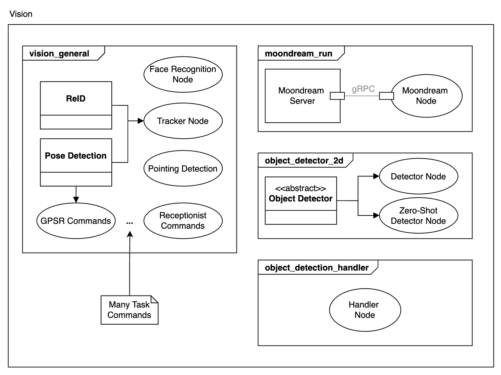
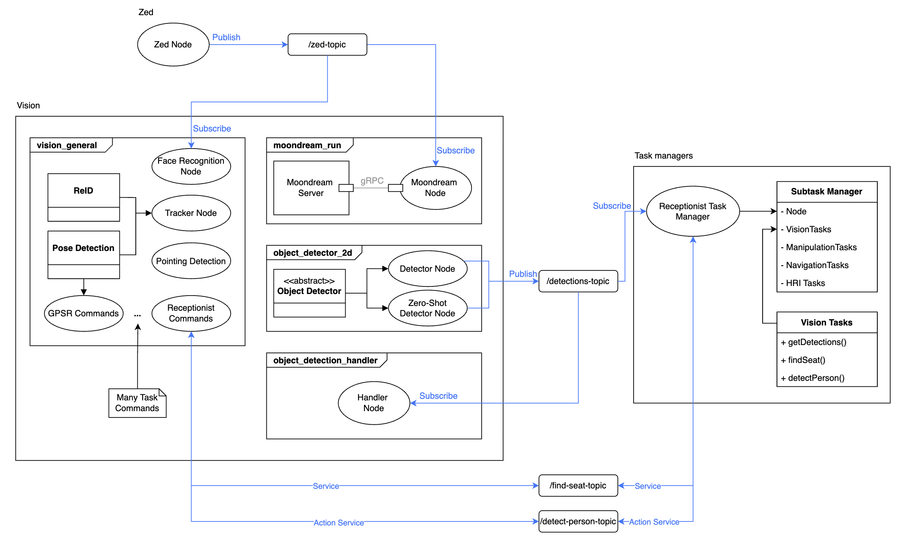

# Architecture Overview

Currently, the vision module is made of several ROS2 packages:

- **vision_general**: Contains nodes and classes that could be used for several tasks. It includes: face recognition, person tracking, pointing and other general purpose nodes. It also includes all task specific nodes such as receptionist_commands, gpsr_commands, etc.

- **moondream_run**: Contains the server with moondream model and client node. (Moondream is a visual-language model that can be used for image prompting).

- **object_detector_2d**: Runs detector trained with dataset and/or zero-shot model detector.

- **object_detection_handlder**: C++ handler used mostly by manipulation.

## Structure

The following diagram shows the package structure:

Diagram key:

## ROS interaction

For a more detailed view of how some components interact check the following diagram. It shows an example of how nodes subscribe to the zed topic to receive images. It also shows examples of node publishers and services that are then used by the task manager to execute tasks.

