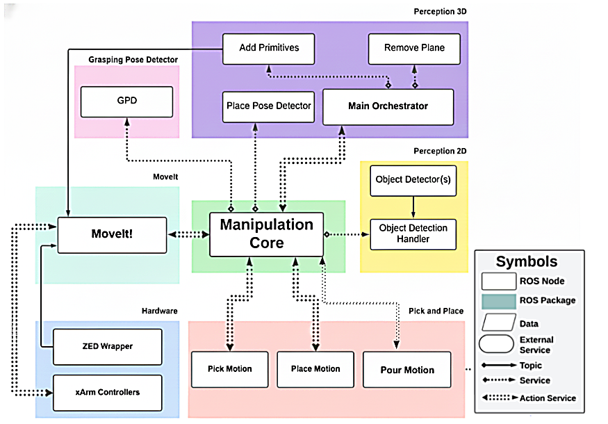
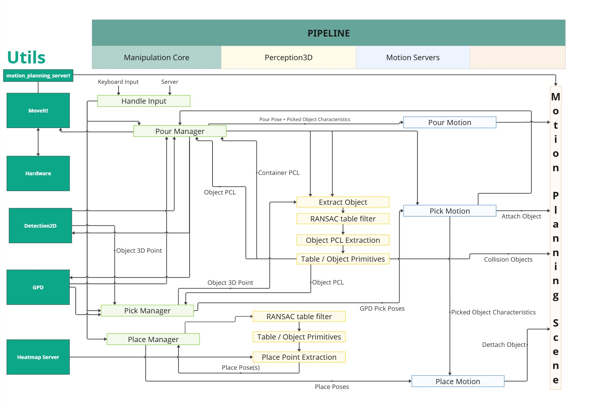

# Architecture

TMR 2025 had the best implementation of both pick and place tasks from recent years on RoBorregos. It also saw a big shift in the structure of nodes and their communication, made considering both ROS2 capabilities and escalability for further tasks on the area.

## Node Architecture

## Task Pipeline

Manipulation Core connects most nodes and handles the logic to achieve every task. It reduces opening clients on more than one node, such as connecting to perception for both pick and place nodes. Motion planning to goals is handled by several nodes called motion servers, which all connect to MoveIt to do so. 

This core, internally, is structured to have "managers" for each task, which handle the logic of every tassk and use the assets from the core to execute them.

