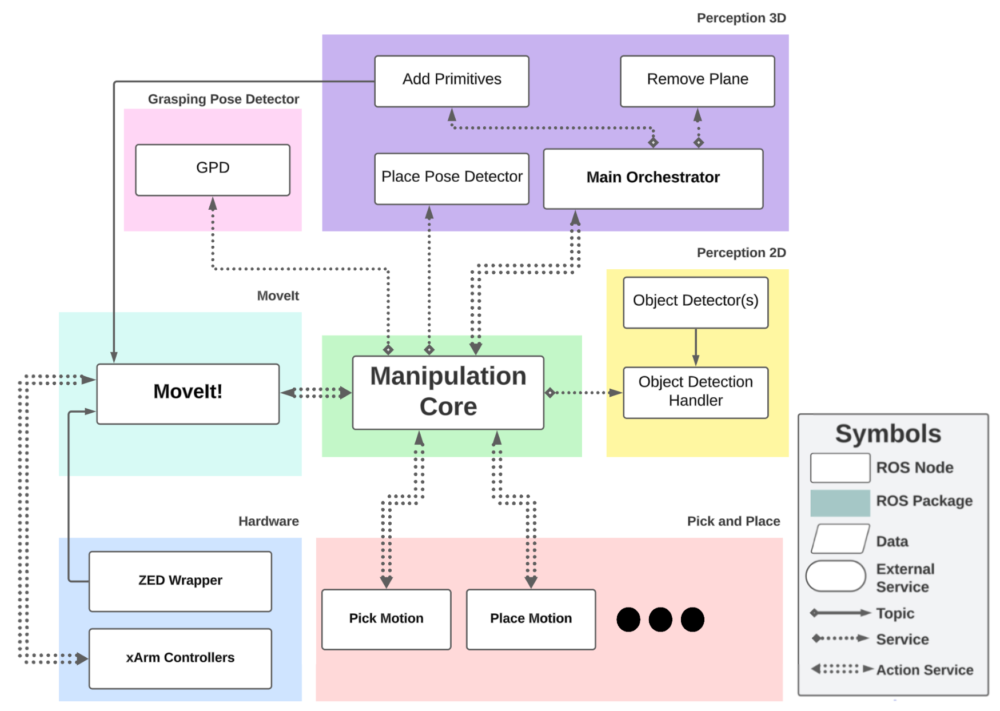
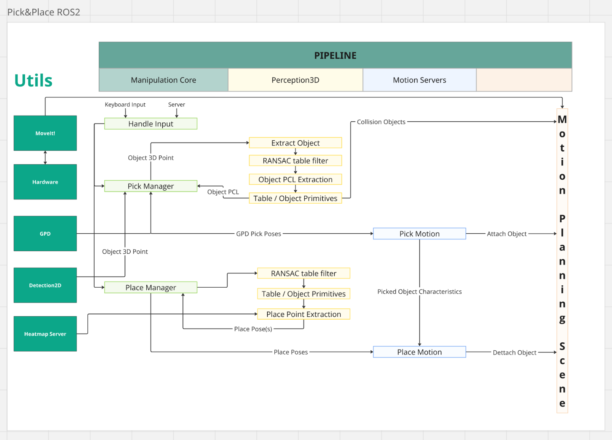

# Architecture

TMR 2025 had the best implementation of both pick and place tasks from recent years on RoBorregos. It also saw a big shift in the structure of nodes and their communication, considering both ROS2 capabilities and escalability for further tasks on the area.

The core of the system is designed around robust communication and specialized management. The Manipulation Core serves as the central logic handler, connecting most nodes and orchestrating task achievement. It minimizes system overhead by reducing the need for redundant client connections across multiple nodes (e.g., accessing perception for both picking and placing). Internally, it uses specialized "Managers" for each task, which handle the unique logic of their respective operations using the core's assets. All movements to specified goals are planned by the Motion Servers. These servers interface with MoveIt! to generate and execute collision-free trajectories.

The manipulation experiment was carried out using a 6-DOF robotic arm equipped with a custom parallel gripper, integrated within a ROS 2–based architecture. The experiment evaluated the robot’s ability to autonomously perform pick, place, and pour actions by combining perception, motion planning, and execution modules. Object detection in 2D was projected into 3D space using depth data, enabling point-cloud segmentation and scene simplification through planar extraction and primitive modeling. Grasp poses were generated from the segmented objects and validated based on kinematic reachability and collision constraints. Motion execution relied on a hybrid planning strategy, using sampling-based planners for constrained manipulation and direct joint interpolation for auxiliary movements. The experiment was repeated under varying object configurations to assess robustness, achieving reliable performance in realistic domestic manipulation scenarios.

## Node Architecture

## Task Pipeline

The developed pipeline enables precise interaction with a 6-DOF robotic arm and its custom gripper for picking, placing, and pouring, integrating perception and motion planning components.

Motion Planning

The system employs a Hybrid Motion Planning strategy. It utilizes Sampling-based Planning (RRTConnect) for generating collision-free trajectories during complex manipulation (like pouring), enforcing strict orientation constraints, while employing Direct Joint Interpolation for high-speed, and auxiliary tasks (homing, scanning) in free space.

Pick motion

The Picking Strategy achieved an 80% reliability rate, enabling precise target isolation by fusing 2D detection data with 3D point clouds using the Point Cloud Library (PCL). To minimize latency, parallel filtering and variable-resolution downsampling are employed. The planning scene is optimized by modeling the table as a box and obstacles as spheres using RANSAC. GPD interprets object clusters, allowing MoveIt! to efficiently plan trajectories within the simplified environment.

Place motion 

The Placing Strategy demonstrated a high 95% reliability rate. The optimal placement pose is determined by combining two costmaps: a Gaussian Base Heatmap (favoring free space) and a Special Request Heatmap (encoding relative constraints like "in front of").

Pour motion

For the Pouring Strategy, the container's 3D cluster is analyzed (PCL) to determine the centroid and rim height. The PourMotion server uses MoveIt! with dynamic orientation path constraints to define a pour_pose above the center and prevent spillage.

Finally, the Custom Gripper is a parallel mechanism powered by a rack-and-pinion system. Its innovation lies in its fingers, which incorporate fractal-structured silicone covers and soft inner materials, enhancing deformation and adaptability for objects up to 1 kg.

The developed pipeline enables precise interaction with a 6-DOF robotic arm and its custom gripper for picking, placing, and pouring, integrating perception and motion planning components.
Motion Planning
The system employs a Hybrid Motion Planning strategy. It utilizes Sampling-based Planning (RRTConnect) for generating collision-free trajectories during complex manipulation (like pouring), enforcing strict orientation constraints, while employing Direct Joint Interpolation for high-speed, and auxiliary tasks (homing, scanning) in free space.
Perception 3D 

Responsible for transforming the raw sensor data from the Zed into a structured geometric representation of the manipulation scene suitable for motion planning and task execution. The process starts by obtaining objects from a 2D detector which is protected into 3D space, realizing a point-cloud-based segmentation using the Point Cloud Library (PCL) to isolate objects and supporting surfaces. A RANSAC-based filtering stage identifies and removes dominant planar structures, such as tables, enabling robust separation between manipulable objects and the environment. The resulting object point claud is then refined and converted into geometric primitives, like spheres and collision objects that are injected into the planning scene, ensuring a better visualization for collision-aware manipulation. 

Object-Picking Phase

Phase responsible for autonomously selecting a grasp pose and executing a collision-aware grasp of a target object. This phase is orchestrated by the *Pick Manager* within the Manipulation Core. Once an object of interest has been detected in 2D and protected into 3D space, **Perception 3D** provides a refined point cloud using the *Point Cloud Library (PCL)* along with corresponding collision primitives, such as a box in representation of the table and obstacle spheres for the surrounding environment. To minimize latency, parallel filtering and variable-resolution downsampling is employed. The isolated object point claud is then passed to the *Grasp Pose detection (GPD)* module which generates multiple candidates for grasp poses based on the local surface geometry. These grasp options are evaluated by the *Pick Manager*, which selects a feasible grasp according to the kinematic reachability, collision constraints and the task context restrictions. The selected grasp pose is then forwarded to the *Pick Motion Server*, which plans and executes the approach using MoveIt!. Using this approach the Picking Strategy achieved an 80% reliability rate. 

Object-Placing Phase

The Placing strategy determines a stable and collision-free location for depositing the previously grasped object. This phase is coordinated by the *Place Manager* and spatial information provided by the Perception 3D together with probabilistic placement reasoning. Using the segmented table surface and the object primitives from the Perception 3D, the system constructs a valid placement surface model. A Gaussian Heatmap-based placement strategy is employed to evaluate candidate placement position toward preferred regions of the surface allowing task-dependent placement behaviors. The heatmap encodes spatial preferences and constraints, which are sampled to generate candidate place poses in a Cartecian space, favoring free space. These poses are validated against collision constraints using the current planning scene. Validated poses are sent to *Place Motion Server*, which plans and executes the placement trajectory. If requested, another Special Request Heatmap is created for special constraints like “in front of”, which is compared with the Gaussian Heatmap-based from the surface to evaluate the optimal placement pose. The Placing Strategy demonstrated a high 95% reliability rate. 

Object-Pouring Phase

The pouring phase, orchestrated by the *Pour Manager* process enables controlled liquid-transfer actions by a perception-driven, geometry-aware puritan action by analyzing 3D point cloud information to infer the spatial properties of the target container. After the pouring object has been successfully picked, the *Perception 3D* pipeline is requested to obtain a segmented point cloud of the container. From this point cloud, the centroid of the container is computed as the mean of all points, while the container height is estimated using the maximum vertical coordinates of the cluster. With this information, a **pour_pose** is defined above the center, retaining the gripper’s pick orientation and preserving the kinematic consistency between the grasp and pour. The computed pour_pose, together with the pick result is passed to the *Pour Motion Server*, which generates a collision-aware and orientation-constrained trajectory using motion planning. Throughout the pouring motion, the object remains attached to the end-effector in the planning scene, allowing an accurate collision checking. 
Finally, the Custom Gripper is a parallel mechanism powered by a rack-and-pinion system. Its innovation lies in its fingers, which incorporate fractal-structured silicone covers and soft inner materials, enhancing deformation and adaptability for objects up to 1 kg.
