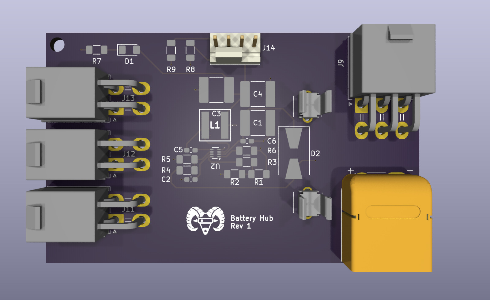

# Weekly Spotlights
This page is a collection of weekly spotlights that highlight the progress of the integration team. Each spotlight is a summary of the work done by the team in a week.

Member status:

- 🔍: Research
- 💻: Development
- 📝: Documentation
- 🔄: Refactoring
- 🔧: Bug fixing
- 🤝: Participation in other subteam

## 09-25-2025

| Name     |Status|
| -------- | ---- |
| Samuel   |  🔍  |
| Rodrigo  |  💻  |
| Fregoso  |  💻  |
| Daniel   |  💻  |
| Melanie  |  🤝  |
| Ximena   |  💻  |
| Rogelio  |  💻  |

**Development**:
- First PCB 

**On planning**:
- Creating a 