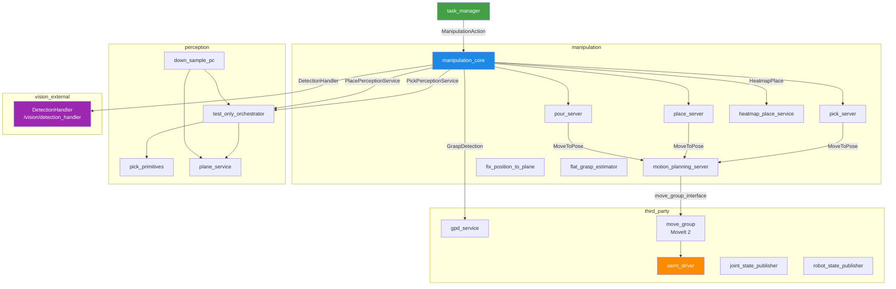
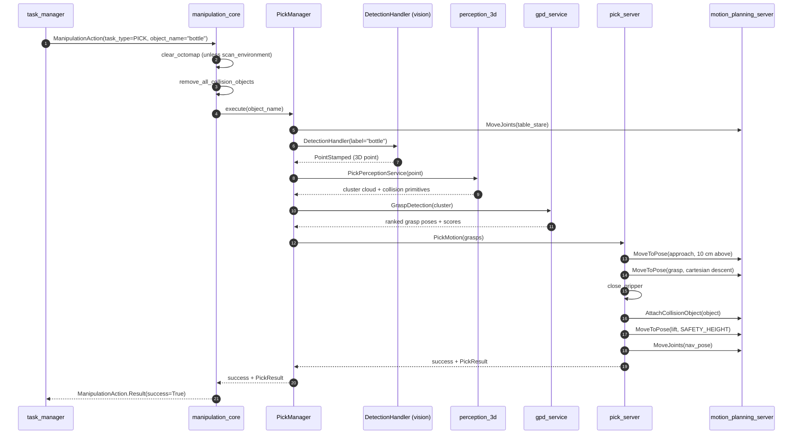
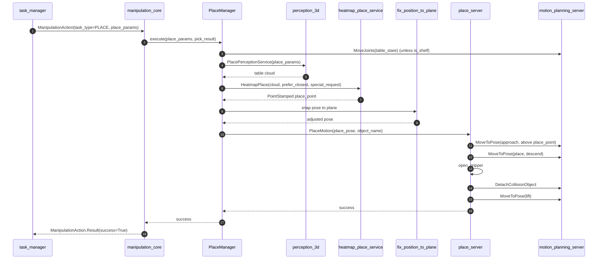
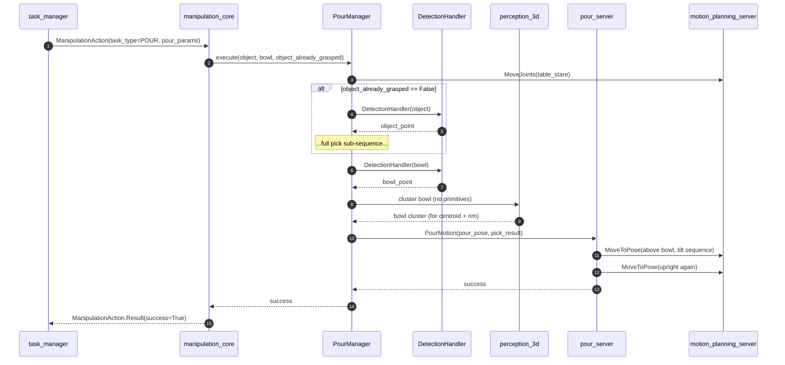

# Architecture

How the manipulation stack is wired at runtime: which nodes come up, which interfaces they expose, and the exact data flow for each of the three core operations — **pick**, **place**, **pour**.

!!! abstract "TL;DR"
    - `manipulation_core` is the single entry point for task managers. Everything below it is internal.
    - The pick / place / pour pipelines are coordinated by **Managers** that call perception → grasp generation → motion in sequence.
    - All motion goes through `motion_planning_server`, which wraps MoveIt 2.
    - Endpoint names and tuning constants live in `frida_constants` — **never** hard-code them.

## Node graph

A complete `ros2 launch pick_and_place pick_and_place.launch.py` brings up these nodes:



### Full launch chain

```
ros2 launch manipulation_general <task>.launch.py
├── arm_pkg/frida_moveit_config.launch.py
│   ├── xarm_description/_robot_description.launch.py
│   ├── arm_pkg/frida_moveit_common.launch.py     ← move_group + planning scene + RViz
│   ├── xarm_controller/_ros2_control.launch.py
│   ├── joint_state_publisher
│   └── perception_3d/downsample_pc.launch.py
└── pick_and_place/pick_and_place.launch.py
    ├── gpd_service                                (arm_pkg)
    ├── manipulation_core
    ├── pick_server
    ├── place_server
    ├── pour_server
    ├── perception_3d/perception_3d.launch.py
    │   ├── pick_primitives
    │   ├── plane_service
    │   └── test_only_orchestrator
    ├── heatmap_place_service                      (place)
    ├── motion_planning_server                     (frida_motion_planning)
    ├── fix_position_to_plane                      (pick_and_place)
    └── flat_grasp_estimator                       (perception_3d)
```

## Public surface

Task managers should interact with manipulation only through:

| Type | Constant | Endpoint | Goal type |
|---|---|---|---|
| **Action** | `MANIPULATION_ACTION_SERVER` | `/manipulation/manipulation_action_server` | `frida_interfaces/action/ManipulationAction` |
| **Action** | `GO_TO_HAND_ACTION_SERVER` | `/manipulation/go_to_hand_action_server` | `frida_interfaces/action/GoToHand` |

Everything below those — `MoveToPose`, `MoveJoints`, `PickMotion`, `PlaceMotion`, `PourMotion`, collision-scene services — is **internal**. Task-manager code should not call them directly.

!!! example "How to call `ManipulationAction` from a task manager"

    ```python
    from rclpy.action import ActionClient
    from frida_interfaces.action import ManipulationAction
    from frida_interfaces.msg import ManipulationTask
    from frida_constants.manipulation_constants import MANIPULATION_ACTION_SERVER

    client = ActionClient(node, ManipulationAction, MANIPULATION_ACTION_SERVER)
    client.wait_for_server()

    goal = ManipulationAction.Goal()
    goal.task_type = ManipulationTask.PICK
    goal.pick_params.object_name = "bottle"
    goal.scan_environment = False
    future = client.send_goal_async(goal)
    ```

## Pick — sequence diagram



??? note "Cutlery sub-path"
    If `object_name ∈ {fork, knife, spoon, cutlery}` (constant `CUTLERY_NAMES`), `PickManager` skips the GPD path:

    1. Move to `cutlery_stare`.
    2. Subscribe to `/manipulation/flat_grasp_pose` and average ≥10 samples.
    3. Send the averaged pose to `pick_server`, which performs a **force-guarded descent** (xArm mode 5, ~20 mm/s, abort on joint-effort threshold).

## Place — sequence diagram



## Pour — sequence diagram



## Endpoint reference (constants)

All names live in `frida_constants/manipulation_constants.py`. Import them; do not hard-code.

### Actions

| Constant | Endpoint |
|---|---|
| `MANIPULATION_ACTION_SERVER` | `/manipulation/manipulation_action_server` |
| `PICK_MOTION_ACTION_SERVER` | `/manipulation/pick_motion_action_server` |
| `PLACE_MOTION_ACTION_SERVER` | `/manipulation/place_motion_action_server` |
| `POUR_MOTION_ACTION_SERVER` | `/manipulation/pour_motion_action_server` |
| `MOVE_TO_POSE_ACTION_SERVER` | `/manipulation/move_to_pose_action_server` |
| `MOVE_JOINTS_ACTION_SERVER` | `/manipulation/move_joints_action_server` |
| `GO_TO_HAND_ACTION_SERVER` | `/manipulation/go_to_hand_action_server` |

### Services

| Constant | Endpoint | Owned by |
|---|---|---|
| `GRASP_DETECTION_SERVICE` | `/manipulation/detect_grasps` | `gpd_service` |
| `PICK_PERCEPTION_SERVICE` | `/manipulation/pick_perception_service` | `test_only_orchestrator` |
| `PLACE_PERCEPTION_SERVICE` | `/manipulation/place_perception_service` | `test_only_orchestrator` |
| `HEATMAP_PLACE_SERVICE` | `/manipulation/heatmap_place_service` | `heatmap_place_service` |
| `GRIPPER_SET_STATE_SERVICE` | `/manipulation/gripper/set_state` | gripper driver |
| `ADD_COLLISION_OBJECT_SERVICE` | `/manipulation/add_collision_objects` | `motion_planning_server` |
| `REMOVE_COLLISION_OBJECT_SERVICE` | `/manipulation/remove_collision_object` | `motion_planning_server` |
| `ATTACH_COLLISION_OBJECT_SERVICE` | `/manipulation/attach_collision_object` | `motion_planning_server` |
| `GET_COLLISION_OBJECTS_SERVICE` | `/manipulation/get_collision_objects` | `motion_planning_server` |
| `TOGGLE_SERVO_SERVICE` | `/manipulation/toggle_servo` | `motion_planning_server` |
| `GET_JOINT_SERVICE` | `/manipulation/get_joints` | `motion_planning_server` |
| _(MoveIt built-in)_ | `/clear_octomap` | `move_group` |

### Topics

| Constant | Topic | Direction |
|---|---|---|
| `GRIPPER_GRASP_STATE_TOPIC` | `/gripper/grasp_state` | pub: gripper driver |
| `PLACE_POINT_DEBUG_TOPIC` | `/manipulation/table_place_point_debug` | pub: heatmap |
| `DEBUG_POSE_GOAL_TOPIC` | `/manipulation/debug_pose_goal` | pub: motion_planning_server |
| `ZED_POINT_CLOUD_TOPIC` | `/zed/zed_node/point_cloud/cloud_registered` | sub: ZED |
| — | `/manipulation/flat_grasp_pose` | pub: flat_grasp_estimator |
| — | `/manipulator/place_ee_link_pose` | pub: place_server |
| — | `/clicked_point` | sub: manipulation_client (debug) |

## Tuning constants

| Constant | Default | Meaning |
|---|---|---|
| `PICK_VELOCITY` | `0.5` m/s | Maximum EE velocity during pick segments. |
| `PICK_ACCELERATION` | `0.15` m/s² | Maximum EE acceleration. |
| `PICK_PLANNER` | `"RRTConnect"` | Default OMPL planner. |
| `SCAN_ANGLE_VERTICAL` | `30°` | Vertical sweep during shelf scan. |
| `SCAN_ANGLE_HORIZONTAL` | `30°` | Horizontal sweep. |
| `SAFETY_HEIGHT` | `0.05` m | Minimum lift above the object after grasp. |
| `PICK_MIN_HEIGHT` | `0.04` m | Object floor below which we don't attempt to pick. |
| `CUTLERY_PICK_MIN_HEIGHT` | `0.002` m | Same but for thin objects. |
| `PICK_MAX_DISTANCE` | `1.0` m | Reject detections beyond this. |
| `PLACE_MAX_DISTANCE` | `0.8` m | Heatmap search radius. |
| `SHELF_MIN_REACH` | `0.40` m | Minimum reach for shelf picks. |
| `SHELF_REACH_BASE` | `0.75` m | Linear reach model offset. |
| `SHELF_REACH_SLOPE` | `0.25` | Linear reach model slope. |
| `AIM_STRAIGHT_FRONT_QUAT` | `[0.650, -0.290, 0.636, -0.299]` | Frontal-aim orientation. |

### Pick / Place perception constants

| File | Constant | Default | Effect |
|---|---|---|---|
| `remove_plane.cpp` | `setMaxIterations` | `1000` | RANSAC iterations for plane fit. |
| `remove_plane.cpp` | `setDistanceThreshold` | `0.03` m | RANSAC inlier tolerance. |
| `remove_plane.cpp` | `setClusterTolerance` | `0.04` m (primary) | Euclidean cluster spacing. |
| `remove_plane.cpp` | `setMinClusterSize` | `100` points | Reject smaller blobs. |
| `remove_plane.cpp` | `setMaxClusterSize` | `25 000` points | Cap on the largest cluster. |
| `down_sample_pc.cpp` | `small_size` | `0.01` m | Fine voxel leaf for picks. |
| `down_sample_pc.cpp` | `large_size` | `0.10` m | Coarse voxel leaf for nav. |
| `heatmapPlace_Server.py` | `grid_size` | `0.015` m | Heatmap cell size. |
| `heatmapPlace_Server.py` | `heat_kernel_length` | `0.30` m | Gaussian span over free space. |
| `heatmapPlace_Server.py` | `cool_kernel_length` | `0.15` m | Penalty span over occupied space. |
| `heatmapPlace_Server.py` | `cool_multiplier` | `10.0` | Weight on obstacle penalty (vs. `heat_multiplier=1.0`). |

## TF frames

| Frame | Meaning |
|---|---|
| `link_base` | Arm base — most internal poses are expressed here. |
| `base_link` | Mobile base. The heatmap expects input clouds in this frame. |
| `link_eef` | Last link of the kinematic chain — default MoveIt target. |
| `gripper_grasp_frame` | Gripper contact point. GPD grasp poses come back in this frame. |
| `zed_left_camera_optical_frame` | Source frame of the ZED point cloud and depth image. |

!!! warning "`link_eef` vs `gripper_grasp_frame`"
    They differ by a known offset of `~0.09 m` (controlled by the `ee_link_offset` parameter on `pick_server`; default in the launch is `-0.09`). Forgetting this offset causes the gripper to descend through the table.

## Octomap & `scan_environment`

`manipulation_core` calls `clear_octomap` at the start of every action **unless** `goal.scan_environment == True`. When set to true (used for shelf picks), the core first calls `scan_environment()`, which sweeps `joint1` by `±SCAN_ANGLE_HORIZONTAL` and `joint5` by `±SCAN_ANGLE_VERTICAL` to populate the octomap with shelf geometry before planning.

## Debug topics worth knowing

| Topic | Use case |
|---|---|
| `/manipulation/flat_grasp_pose` | Live cutlery grasp candidate. |
| `/gripper/grasp_state` | Whether the gripper currently has contact. |
| `/manipulation/table_place_point_debug` | Last heatmap-selected place point. |
| `/manipulator/place_ee_link_pose` | Last EE pose sent to a place. |
| `/manipulation/debug_pose_goal` | Last pose goal received by motion_planning_server. |
| `/manipulation/debug_object_point` | Pour: object 3D point. |
| `/manipulation/debug_bowl_point` | Pour: bowl 3D point. |
| `/manipulation/debug_bowl_centroid` | Pour: centroid of the bowl cluster. |
| `/clicked_point` | RViz "Publish Point" → `manipulation_client` triggers a pick. |

!!! tip "RViz first, code second"
    For 80% of bugs, opening RViz and visualising the planning scene + the debug topics above is faster than reading the logs. Add these topics to your default RViz config.
