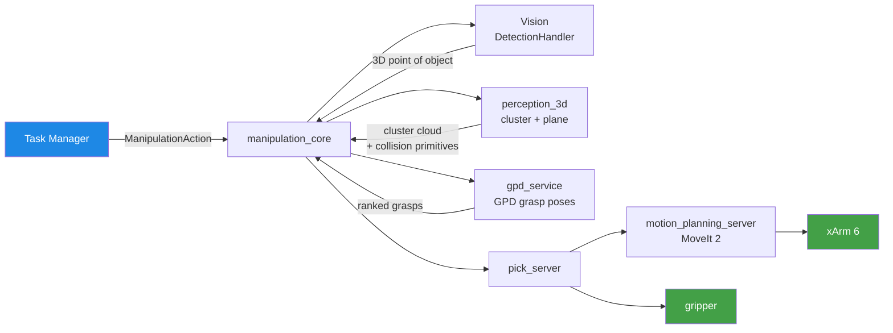

# Manipulation

The **Manipulation** area is responsible for every physical interaction FRIDA has with the world: picking and placing objects on tables and shelves, pouring liquids, handing objects to people, opening containers, and any other operation that uses the arm or gripper. It bridges three disciplines — **2D vision**, **3D perception**, and **motion planning** — behind a single ROS 2 action interface that every task manager calls.

!!! tip "New to the area?"
    Read this page first, then jump to **[Setup & Build](setup.md)** to get the stack running on your machine, and **[Running Tasks](tasks.md)** for your first end-to-end pick.

## What this section contains

-   :material-rocket-launch:{ .lg .middle } **[Setup & Build](setup.md)**

    ---

    Clone the repo, bring up the manipulation Docker container, build the
    workspace, and validate your environment.

-   :material-graph-outline:{ .lg .middle } **[Architecture](architecture.md)**

    ---

    Node graph, sequence diagrams for pick / place / pour, the full list
    of topics, services, actions, and tunable constants.

-   :material-package-variant:{ .lg .middle } **[Packages](packages.md)**

    ---

    A tour through every package in `manipulation/packages/` — what it
    does, what files matter, and which third-party libraries we vendor.

-   :material-robot:{ .lg .middle } **[Running Tasks](tasks.md)**

    ---

    How to launch picks, places, pours, and the competition tasks.
    Includes the interactive `keyboard_input.py` reference.

-   :material-api:{ .lg .middle } **[Interfaces](interfaces.md)**

    ---

    Reference for every `.action`, `.srv`, and `.msg` in
    `frida_interfaces/manipulation/`.

-   :material-calendar-week:{ .lg .middle } **[Spotlights](spotlights.md)**

    ---

    Week-by-week development log going back to 2024.

## Hardware

| Component | Detail |
|---|---|
| **Arm** | UFactory **xArm 6** (6 DOF) |
| **Gripper** | Custom 2-finger parallel gripper with fractal silicone fingers |
| **3D Sensor** | Stereolabs **ZED 2** stereo camera |
| **Compute (robot)** | NVIDIA **Jetson Orin** |
| **Simulator** | **MuJoCo** (primary), Webots (exploratory) |
| **Framework** | ROS 2 Humble, MoveIt 2, PCL, OpenCV |

The arm is driven by MoveIt 2 through the standard `follow_joint_trajectory` action. The custom gripper exposes a single boolean service (`/manipulation/gripper/set_state`) and a `GripperGraspState` topic indicating contact.

## High-level pipeline

A request from the task manager (for example, "pick the bottle") flows through these stages:

`manipulation_core` is the orchestrator. Each request is delegated to a specialized **Manager** (`PickManager`, `PlaceManager`, `PourManager`) that coordinates detection, perception, grasp generation, and motion. All motion is executed by `motion_planning_server`, which wraps MoveIt 2 and the xArm driver.

## The five technical pillars

### :material-eye: 1 — 2D Vision (consumed)

The Manipulation area does not own the 2D detectors, but it depends on them:

- **DetectionHandler** (`vision`) — service `/vision/detection_handler` (constant `DETECTION_HANDLER_TOPIC_SRV`) returns the latest `ObjectDetectionArray` with `label_text`, `bbox`, and `point3d` for each detected object.
- **Zero-shot detector** — published on `ZERO_SHOT_DETECTIONS_TOPIC` for objects outside the trained vocabulary.

`PickManager` queries the handler to obtain the **3D point** of the target object before invoking 3D perception.

### :material-cube-outline: 2 — 3D Perception ([`perception_3d`](packages.md#perception_3d))

PCL-based C++ nodes:

- **`plane_service`** — RANSAC plane segmentation (table / shelf). Returns a plane bbox and a filtered cloud (`distance_threshold = 0.03 m`, `max_iterations = 1000`).
- **`pick_primitives`** — generates collision primitives from a cluster (box for the plane, spheres or mesh for the object) and pushes them into the MoveIt planning scene.
- **`test_only_orchestrator`** — top-level orchestrator that chains the previous two and exposes the unified `PickPerceptionService` / `PlacePerceptionService` consumed by the managers.
- **`flat_grasp_estimator.py`** — Python node specialized for **cutlery**. Uses depth + PCA on the ROI to compute a top-down grasp pose aligned with the principal axis.
- **`down_sample_pc`** — voxel downsampling of the incoming ZED cloud (default leaf `0.01 m`, large-leaf nav variant `0.10 m`).

### :material-hand-back-right: 3 — Grasp Pose Detection ([`gpd`](packages.md#gpd))

The **GPD** library ([RoBorregos/gpd](https://github.com/RoBorregos/gpd) — fork of [atenpas/gpd](https://github.com/atenpas/gpd)) is registered in the repo as a submodule under `manipulation/packages/gpd/` and built into `/workspace/install/gpd` by `setup_gpd.sh`. It is exposed to ROS through `gpd_service` (in [`arm_pkg`](packages.md#arm_pkg)): given a cluster and a viewpoint, it returns a ranked list of `geometry_msgs/PoseStamped` grasp candidates.

GPD is configured via `arm_pkg/config/frida_eigen_params_custom_gripper.cfg`, which encodes the gripper geometry, sampling and scoring parameters.

### :material-routes: 4 — Motion Planning

We use a **two-layer** stack:

| Layer | Package | Responsibility |
|---|---|---|
| **Wrapper** | [`frida_motion_planning`](packages.md#frida_motion_planning) | Python action / service interface (`MoveToPose`, `MoveJoints`, collision-scene services, servo). |
| **Backend** | MoveIt 2 + [`frida_pymoveit2`](packages.md#frida_pymoveit2) | Trajectory generation, kinematics, planning-scene management. Default planner: **RRTConnect**. |

The arm runs on the **IKFast** analytical solver for xArm 6 (`xarm6_ikfast_plugin`) instead of KDL — significantly faster IK during pick planning.

!!! info "About VAMP"
    [VAMP](https://github.com/KavrakiLab/vamp) (Vector-Accelerated Motion Planning) integration was developed during the 2026 cycle on a feature branch but **is not in `main`** as of this writing. The supporting packages (`vamp`, `foam`, `cricket`) are therefore not part of the current build.

### :material-hand-clap: 5 — Pick / Place / Pour ([`pick_and_place`](packages.md#pick_and_place))

The core ROS layer the team maintains:

- **`manipulation_core.py`** — exposes the top-level `ManipulationAction` and dispatches to managers.
- **`pick_server.py`** — implements approach, descent, grasp, lift. Has a **force-guarded descent** mode for cutlery (xArm mode 5 + joint-effort threshold).
- **`place_server.py`** — drives the place motion (top-down or shelf, optional `forced_pose`).
- **`pour_server.py`** — drives pour motions, including a path for an object that is **already grasped**.
- **`fix_position_to_plane.py`** — service that snaps a candidate pose down to the closest extracted plane.
- **`HeatmapPlace`** service ([`place`](packages.md#place)) — generates the optimal place point using a Gaussian heatmap on the table cloud.

## At-a-glance: where do I edit X?

| To change… | Edit |
|---|---|
| The pick sequence (approach, descend, lift) | `pick_and_place/managers/PickManager.py` |
| The place sequence | `pick_and_place/managers/PlaceManager.py` |
| The pour sequence | `pick_and_place/managers/PourManager.py` |
| Top-down descent / force guard (cutlery) | `pick_and_place/pick_server.py` |
| MoveIt connection (velocity, planner, IK) | `frida_motion_planning/utils/MoveItPlanner.py` |
| Named joint configurations (`table_stare`, `nav_pose`, …) | `frida_constants/xarm_configurations.py` |
| Topic / service / action names | `frida_constants/manipulation_constants.py` |
| GPD scoring / gripper geometry | `arm_pkg/config/frida_eigen_params_custom_gripper.cfg` |
| Plane RANSAC parameters | `perception_3d/src/remove_plane.cpp` |
| Cluster extraction parameters | `perception_3d/src/add_primitives.cpp` |
| Heatmap (place pose) logic | `place/scripts/heatmapPlace_Server.py` |
| URDF / SRDF / collision matrix | `robot_description/` + `arm_pkg/moveit_configs_builder.py` |
| What launches for each competition task | `manipulation_general/launch/<task>.launch.py` |

## Pre-requisites for new members

Before opening a PR, make sure you are comfortable with:

- [x] **ROS 2 Humble** basics — `ros2 node/topic/service/action`, parameters, launch files.
- [x] **MoveIt 2** conceptually — planning scene, collision objects, planning groups, `move_group_interface`.
- [x] The repo layout — `home2` is cloned with `--recursive`; vendored submodules are touched in **separate** PRs.
- [x] Our **Docker workflow** ([Setup](setup.md)) — never `pip install` on the host, always work inside the container.
- [x] `frida_constants` — never hard-code a topic / service name in Python; import the constant.

## Glossary

| Term | Meaning |
|---|---|
| **FRIDA** | Friendly Robotic Interactive Domestic Assistant — RoBorregos' @Home robot. |
| **EE / end-effector** | The last link of the arm chain. Default frame: `link_eef`. The gripper contact point lives at `gripper_grasp_frame`. |
| **GPD** | Grasp Pose Detection ([atenpas/gpd](https://github.com/atenpas/gpd)) — library that scores candidate grasp poses on a point cloud. |
| **IKFast** | OpenRAVE / MoveIt analytical IK solver — replaces KDL for faster, deterministic inverse kinematics. |
| **Octomap** | MoveIt's voxel-based occupancy map used for collision avoidance against arbitrary geometry. |
| **Manager** | A Python class inside `pick_and_place/managers/` that owns the high-level logic of one operation (Pick / Place / Pour). |
| **Stare pose** | A named joint configuration (`table_stare`, `cutlery_stare`, etc.) that places the camera at a known viewpoint before perception. |
| **Cluster** | A connected component of the ZED point cloud, extracted by Euclidean clustering after plane removal. |
| **Force-guarded descent** | xArm mode 5 + joint-effort threshold — used for cutlery so the gripper stops on table contact instead of slamming. |
