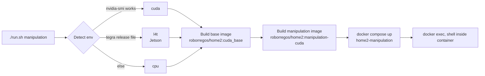
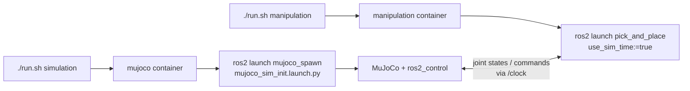

# Setup & Build

Every piece of manipulation code runs inside a **Docker container** managed by the top-level `./run.sh` script in [RoBorregos/home2](https://github.com/RoBorregos/home2). The host only needs Docker, Git, and, on a CUDA machine, the NVIDIA Container Toolkit.

!!! danger "Do not install ROS / MoveIt / PCL on the host"
    All dependencies live inside the container. Anything you install on the host risks polluting future runs and confusing teammates. If you need a tool, add it to the Dockerfile.

## Prerequisites

- [x] [Docker Engine](https://docs.docker.com/engine/install/) + Docker Compose plugin
- [x] [Git](https://git-scm.com/downloads)
- [x] [NVIDIA Container Toolkit](https://docs.nvidia.com/datacenter/cloud-native/container-toolkit/install-guide.html) (only on CUDA hosts)
- [x] At least **30 GB** of free disk for the image and build artifacts

## Cloning the repo

```bash
git clone --recursive https://github.com/RoBorregos/home2.git
cd home2
```

!!! warning "Did you forget `--recursive`?"
    Many vendored libraries (`gpd`, `vamp`, `foam`, `cricket`, `xarm_ros2`, `pymoveit2`, …) are submodules. If you cloned without `--recursive`, fix it now:

    ```bash
    git submodule update --init --recursive
    ```

## First run

From the **root** of the repo:

```bash
./run.sh manipulation
```

Behind the scenes:



Inside the container, the entry script sources ROS, the cached `frida_interfaces`, GPD, and the CycloneDDS profile, then drops you at `/workspace`. Subsequent runs reuse the existing container instantly.

!!! info "Bind mounts"
    Your local working tree is bind-mounted into `/workspace/src`. Edits on the host are visible immediately inside the container, Python changes need no rebuild.

## Rebuilding

=== "Workspace (most common)"

    Inside the container, two equivalents exist:

    **A. The `build` alias** in `docker/manipulation/.bash_aliases`:

    ```bash
    build
    ```

    expands to:

    ```bash
    cd /workspace \
      && source frida_interfaces_cache/install/local_setup.bash \
      && colcon build --symlink-install \
           --packages-up-to manipulation_general \
           --packages-ignore realsense_gazebo_plugin xarm_gazebo frida_interfaces
    ```

    **B. The wider build used by `./run.sh manipulation --build`** (also includes the IKFast plugin and `xarm_utils`):

    ```bash
    colcon build --symlink-install \
      --packages-up-to manipulation_general xarm6_ikfast_plugin xarm_utils \
      --packages-ignore realsense_gazebo_plugin xarm_gazebo frida_interfaces
    ```

    `frida_interfaces` is built once in a separate stage and **mounted** at
    `/workspace/frida_interfaces_cache`. That is why we ignore it in both
    invocations.

=== "Single package"

    ```bash
    colcon build --symlink-install --packages-select pick_and_place
    ```

    Useful when iterating on one Python file. After the build, `source install/setup.bash`.

=== "Interfaces (.msg / .srv / .action)"

    When you edit a file under `frida_interfaces/manipulation/`, rebuild the
    interfaces cache from the **host**:

    ```bash
    ./run.sh frida_interfaces
    ```

    Then back inside the manipulation container:

    ```bash
    build
    ```

=== "Docker image"

    When `Dockerfile.<env>`, `apt`, or `pip` deps change:

    ```bash
    ./run.sh manipulation --build-image
    ```

=== "Clean rebuild"

    Wipes `build/`, `install/`, `log/`, and the interfaces cache on the host:

    ```bash
    ./run.sh --clean
    ./run.sh manipulation --build
    ```

## GPD setup

GPD is a C++ library compiled from source. The container handles this on entry through `docker/manipulation/setup_gpd.sh`:

1. If `manipulation/packages/gpd/build/` is missing, runs `cmake .. && make && sudo make install`.
2. If the build dir exists but `/usr/local/include/gpd` is missing, recompiles + reinstalls.
3. Otherwise no-op.

`GPD_INSTALL_DIR=/workspace/install/gpd` is exported so `arm_pkg`'s CMake finds the library via `find_library(GPD_LIB …)`.

??? bug "Build fails with `Library GPD not found`"

    Force the install manually:

    ```bash
    . /home/ros/setup_gpd.sh
    export GPD_INSTALL_DIR=/workspace/install/gpd
    build
    ```

## CycloneDDS

We use **CycloneDDS** instead of FastDDS. There are two profiles:

| Profile | When | File |
|---|---|---|
| **Sim / localhost only** | Default when running everything on one machine | `docker/manipulation/cyclonedds_sim.xml` |
| **Network (multi-host)** | When the dev PC talks to the robot over LAN | `cyclonedds.xml` (repo root) |

=== "Bare-metal host (Orin or direct Linux install)"

    Run once per machine:

    ```bash
    sudo bash setup_cyclonedds.sh <INTERFACE>
    source ~/.bashrc
    ```

    Replace `<INTERFACE>` with the network interface name (`eno1`, `wlp2s0`, …). Find it via:

    ```bash
    ip -o link show | awk -F': ' '{print $2}'
    ```

=== "Docker host"

    Run only the kernel-buffer tuning on the host:

    ```bash
    sudo bash setup_cyclonedds.sh --host-only <INTERFACE>
    ```

    Inside the container, the manipulation `.bash_aliases` exports the sim profile automatically:

    ```bash
    export CYCLONEDDS_URI=file:///workspace/src/docker/manipulation/cyclonedds_sim.xml
    ```

!!! tip "Why the sim profile uses localhost only"
    The full pick stack spawns 20+ ROS nodes. WiFi multicast loopback is unreliable, so the sim profile forces unicast peers on `localhost`. It also raises `MaxAutoParticipantIndex` to 120 because the default of 9 is too small.

## Simulation (MuJoCo)



=== "Bring up MuJoCo"

    Open a second terminal and run:

    ```bash
    ./run.sh simulation
    # inside the container:
    ros2 launch mujoco_spawn mujoco_sim_init.launch.py \
        launch_moveit:=true \
        launch_perception:=true
    ```

=== "Launch the pick stack against the sim"

    In the **manipulation** container:

    ```bash
    ros2 launch pick_and_place pick_and_place.launch.py \
        use_sim_time:=true \
        point_cloud_topic:=/filtered_cloud
    ```

!!! warning "`point_cloud_topic` matters"
    On the real robot the default `/point_cloud` works. In MuJoCo, use `/filtered_cloud` (the MoveIt self-filtered topic). Otherwise the cluster picks up parts of the robot's own meshes.

## Touching vendored packages

The repo vendors several upstream projects. **Treat them like third-party code.** The complete list lives in `.gitmodules` at the repo root.

| Package | Source on `main` | Notes |
|---|---|---|
| `gpd` | Submodule → [RoBorregos/gpd](https://github.com/RoBorregos/gpd) (fork of [atenpas/gpd](https://github.com/atenpas/gpd)). | Compiled by `setup_gpd.sh`. |
| `pymoveit2` | Submodule → [RoBorregos/pymoveit2](https://github.com/RoBorregos/pymoveit2). | Used by the motion planning wrappers. Prefer editing **`frida_pymoveit2`** (in-tree) for FRIDA-specific changes. |
| `xarm_ros2` | Submodule → [RoBorregos/xarm_ros2](https://github.com/RoBorregos/xarm_ros2) on branch `xarm_servicios_estable`. | Fork of [xArm-Developer/xarm_ros2](https://github.com/xArm-Developer/xarm_ros2) with our patches enabled. Rarely modify; touch only in a dedicated PR. |
| `mujoco_ros2_control` | Submodule → [RoBorregos/mujoco_ros2_control](https://github.com/RoBorregos/mujoco_ros2_control) on branch `mujoco_servicios_estable`. | Touch only the FRIDA-specific MJCF scene files. |
| `xarm6_ikfast_plugin` | In-tree (regular package). | Generated IKFast plugin for the xArm 6 (merged in PR [#856](https://github.com/RoBorregos/home2/pull/856)). Rebuilt only when DH params change. |
| `frida_pymoveit2` | In-tree (regular package). | Our derivative of `pymoveit2` with xArm-6 group names, IK frames, and named configurations. |

!!! danger "Don't bundle vendored changes with feature work"
    Vendored-package changes go in dedicated PRs so reviewers can scope them. Mixing them with task-manager edits makes diffs unreadable.

## Validation

After your first build, run a quick sanity check:

```bash
# 1. ROS sees the workspace
ros2 pkg list | grep pick_and_place

# 2. The interfaces are sourced
ros2 interface show frida_interfaces/action/ManipulationAction

# 3. MoveIt launches cleanly
ros2 launch arm_pkg frida_moveit_config.launch.py show_rviz:=true
```

If RViz opens with the FRIDA URDF loaded and no red errors in the terminal, you are ready to move on to [Running Tasks](tasks.md).

## Troubleshooting

??? failure "Container exits immediately"
    Run `docker logs home2-manipulation` to see the failure. The usual cause is a stale `build/` from a different env. Run `./run.sh --clean` and retry.

??? failure "`Library GPD not found. Check ENV variable GPD_INSTALL_DIR`"
    GPD didn't install. Run `. /home/ros/setup_gpd.sh && export GPD_INSTALL_DIR=/workspace/install/gpd`, then `build`.

??? failure "`Could not import frida_interfaces.action`"
    The interfaces cache is stale. On the **host** run `./run.sh frida_interfaces`, then re-enter the manipulation container.

??? failure "MoveIt: `No motion plan found` immediately on every plan"
    The octomap is polluted. Clear it:

    ```bash
    ros2 service call /clear_octomap std_srvs/srv/Empty
    ```

??? failure "Failed to load IKFast plugin"
    Build the plugin explicitly:

    ```bash
    colcon build --packages-select xarm6_ikfast_plugin
    source install/setup.bash
    ```

??? failure "Spawning ros2_controllers timed out"
    The xArm driver isn't up. Wait until `frida_moveit_config.launch.py` reports the controllers are loaded before launching `pick_and_place`.

??? failure "Sim sees the robot as a giant point-cloud cluster"
    You're consuming the raw cloud, not the self-filtered one. Add `point_cloud_topic:=/filtered_cloud` to the launch.

??? failure "DDS nodes can't discover each other"
    Confirm `CYCLONEDDS_URI` points at the right XML:

    - Sim / single host → `docker/manipulation/cyclonedds_sim.xml`
    - Multi-host on LAN → `cyclonedds.xml` (root)

## Stop / clean lifecycle

| Command | Effect |
|---|---|
| `./run.sh --stop` | Stop containers, keep state. |
| `./run.sh --down` | Stop and remove containers + networks. |
| `./run.sh --clean` | Delete `build/`, `log/`, `install/`, and the interfaces cache. |

Once your environment runs cleanly, head to **[Running Tasks](tasks.md)**.
