# Weekly Spotlights

This page is a collection of weekly spotlights that highlight the progress of the Object Manipulation team. Each spotlight is a summary of the work done by the team in a given week.

Member-status legend used inline:

- 🔍 Research
- 💻 Development
- 📝 Documentation
- 🔄 Refactoring
- 🔧 Bug fixing
- 🤝 Participation in other subteam

## 2026-06-02

**Done:**
- **Fernando** 💻, Error handler
- **Domínguez** 💻, Test zed in parallel position

**In Progress:**

- **Hector** 💻 , Get centroid and grasp marks for tableware
- **Emil** 💻 , Test rim aproximation and centroid using Open3D and PCA componentes on rim curve.
- **Santiago** 💻 , Fix ZED offset, urdf seems correct

## 2026-05-26

**Done:**
- **Fernando** 💻, Fix remove plane
- **Domínguez** 💻, Merge vamp.
- **Domínguez** 💻, Document Manipulation in Home Docs.
- **Domínguez** 💻, Merge fix simulation.

**In Progress:**

- **Fernando** 💻, Manage nodes respown and xarm restate
- **Domínguez** 💻, Testing zed in parallel position with end effector.
- **Hector** 💻 , Get centroid and grasp marks for tableware
- **Emil** 💻 , Test rim aproximation and centroid using Open3D and PCA componentes on rim curve.
- **Santiago** 💻 , Fix ZED offset, urdf seems correct

## 2026-04-07

**Done:**

- **Efrain** 💻, Simulation with MoveIt implementation.
- **Domínguez** 💻, Get the `grasp_detector` information from the custom gripper for grasp feedback.
- **Domínguez** 💻, Pour refactor for object-already-grasped flow.
- **Domínguez** 💻, Improve picks.
- **Domínguez** 💻, Workflow to ensure `xarm_ros2` integrity.
- **Domínguez** 💻, IKFast analytical IK plugin for xArm 6.

**In Progress:**

- **Domínguez** 💻, Dense cloud database integration with the grasp detector.
- **Domínguez** 💻, Manipulation pipeline optimization.
- **Domínguez** 💻, Testing the Pick & Place Challenge.
- **Domínguez** 💻, Apply grasp-feedback logic in the manipulation pipeline.
- **Efrain** 💻, Connecting the MuJoCo simulation with the rest of the nodes.

## 2026-03-24

**Done:**

- **Emil** 💻, Throw-trash + drop-on-top-of-any-known-object using its point cloud.
- **Fernando** 💻, Integrate "go to hand" into the task manager with vision hand detection and ZED ↔ robot transforms (HRIC task).
- **Efrain** 💻, Advanced PR requirements and review changes.
- **Luis** 💻, Add dishwasher placement.
- **Domínguez** 💻, Correct implementation of VAMP with boxes published.
- **Domínguez** 💻, First test of the Pick & Place Task Manager.

**In Progress:**

- **Domínguez** 💻, Collision avoidance with the octomap.
- **Domínguez** 💻, Improve the pick-cutlery logic.
- **Domínguez** 💻, Pick & Place Task Manager improvements.
- **Luis** 💻, Move follow-face node. Test pour manager.
- **Emil** 💻, Grasp of handles (laundry basket) with initial lift approach.
- **Hector** 💻, Open-door task.
- **Efrain** 💻, Test the point cloud in MuJoCo and its interaction with the pick.
- **Fernando** 💻, Fix plane collision (it generates rotation).
- **Fernando** 💻, Search for a bag pose for navigation while holding a bag in the gripper.
- **Fernando** 💻, Open container.

## 2026-03-10

**Done:**

- **Domínguez** 💻, Pick cutlery.
- **Hector** 💻, Follow hand for grasping bag.
- **Emil** 💻, Place on top of object.
- **Fernando** 💻, Go-to-hand and move-to-point action servers for HRIC "pick bag".
- **Efrain** 💻, MuJoCo: fix gripper control via `xarm_service`.

<iframe width="560" height="315" src="https://www.youtube.com/embed/nkaqR_LuLjs" title="Pick Cutlery" frameborder="0" allowfullscreen></iframe>

<iframe width="560" height="315" src="https://www.youtube.com/embed/LAtaae2D7Zk" title="Go to hand" frameborder="0" allowfullscreen></iframe>

<iframe width="560" height="315" src="https://www.youtube.com/embed/_r7oWEvyoiY" title="Place on top" frameborder="0" allowfullscreen></iframe>

*MuJoCo video in progress.*

**In Progress:**

- **Domínguez** 💻, Test VAMP integration with MoveIt.
- **Domínguez** 💻, Test Pick & Place Task Manager.
- **Luis** 💻, Test pour; research GraspNet to replace current GPD.
- **Emil** 💻, Test "place in trash" / placing on top of trash cans.

## 2026-03-03

**Done:**

- **Domínguez** 💻, Place bag on the floor.
- **Domínguez** 💻, Import VAMP to MoveIt environment.

<iframe width="560" height="315" src="https://www.youtube.com/embed/eMPKwX4tec8" title="Vamp integration with moveit test" frameborder="0" allowfullscreen></iframe>

**In Progress:**

- **Domínguez** 💻, Test VAMP integration with MoveIt.
- **Domínguez** 💻, Pick & Place Task Manager.
- **Luis** 💻, Add interruption when impossible paths are found; reduce planning attempts.
- **Emil** 💻, Place on top of objects (max-Z + centroid for trash place); controllers in Webots.
- **Hector** 💻, Follow hand for grasping bag.
- **Efrain** 💻, MuJoCo: fix gripper control via `xarm_service`.
- **Fernando** 💻, Go-to-hand + move-to-point action servers for HRIC "pick bag".

## 2026-02-24

**Done:**

- **Efrain** 💻, Fix the gripper joint bug.
- **Fernando** 💻, Distance mask: only pick objects within `[min_distance, max_distance]` (MERGED).

**In Progress:**

- **Domínguez** 💻, Import VAMP to MoveIt environment.
- **Domínguez** 💻, Pick & Place Task Manager.
- **Luis** 💻, Add interruption when impossible paths are found; reduce planning attempts.
- **Emil** 💻, Special-request placing on top of objects (max-Z + centroid for trash place).
- **Hector** 💻, Cluster of transparent objects.
- **Efrain** 💻, MuJoCo: fix `gripper_finger` joints and actuators for `ros2_control`.

## 2026-02-17

**Done:**

- **Domínguez, Ale G.** 📝, Fixed manipulation pages for the TDP 2026 paper.

**In Progress:**

- **Fernando** 💻, Distance mask: only pick objects within `[min_distance, max_distance]`.
- **Domínguez** 💻, Import VAMP to MoveIt environment.
- **Luis** 💻, Add interruption when impossible paths are found; reduce planning attempts.
- **Emil** 💻, Webots: add gripper, ZED, and xArm controller to FRIDA.
- **Hector** 💻, Cluster of transparent objects.
- **Efrain** 💻, MuJoCo: add xArm controller and camera.

## 2026-01-29

**Done:**

- VAMP integration with FRIDA.

<iframe width="560" height="315" src="https://www.youtube.com/embed/zVAVS99MIHA" title="Vamp integration with Frida (Test1)" frameborder="0" allowfullscreen></iframe>

<iframe width="560" height="315" src="https://www.youtube.com/embed/7WcWclU6jmc" title="Vamp integration with Frida (Test2)" frameborder="0" allowfullscreen></iframe>

<iframe width="560" height="315" src="https://www.youtube.com/embed/-7KqlR9u-SM" title="Vamp integration with Frida (Test3)" frameborder="0" allowfullscreen></iframe>

- Imported FRIDA's URDF to Webots.

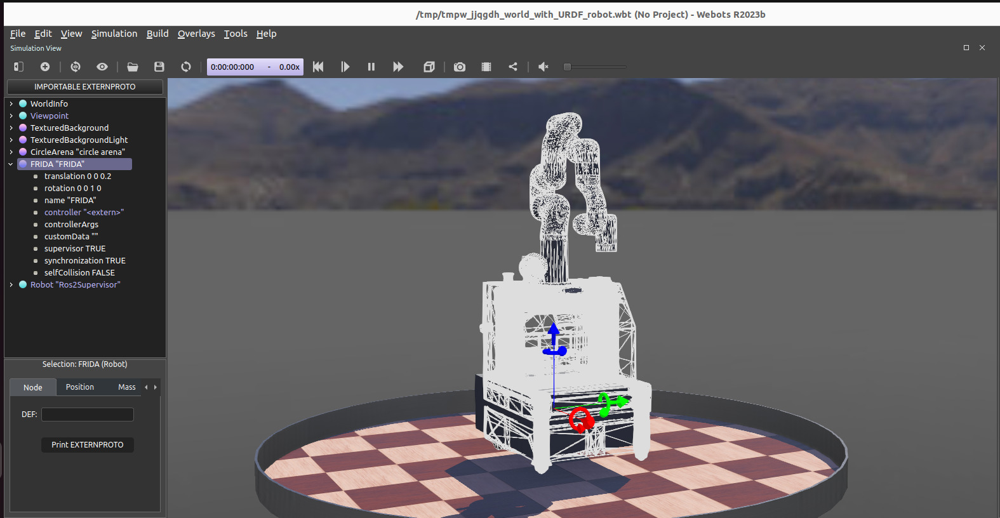

- Spherization of FRIDA's gripper and base for VAMP.
- Fixed manipulation pages of the TDP 2026 paper.

**In Progress:**

- Cluster of transparent objects.
- Import VAMP to MoveIt environment.
- Simulation: MuJoCo (xArm controller) and Webots (gripper, ZED, xArm controller).

## 2026-01-22

**Done:**

- VAMP integration with xArm.

<iframe width="560" height="315" src="https://www.youtube.com/embed/XAExImV6TV4" title="Vamp integration with xarm" frameborder="0" allowfullscreen></iframe>

- Webots connection with ROS 2 for future manipulation implementation.

**In Progress:**

- Fixing the TDP 2026 paper.
- Cluster of transparent objects.
- VAMP integration with FRIDA.
- Spherization of FRIDA's gripper and base for VAMP.
- Simulation: MuJoCo (xArm controller) and Webots (spawn FRIDA).

## 2026-01-15

**Done:**

- First manipulation meeting of 2026.

**In Progress:**

- Fixing the TDP 2026 paper.
- Cluster of transparent objects.
- Working on simulation.

## 2025-11-21

**Main priority:** add all developments to the TDP 2026 paper.

**Done:**

- Place objects around other objects (e.g. place cup at the right of zucaritas box).
- Fixed `dev/manipulation` repo on the Jetson Orin.

**In Progress:**

- TDP 2026 paper.
- Stabilize the follow-face module in real time.
- Place-trash action.
- Pick error.
- Fix octomap logic issues.
- Handle exceptions in the manipulation pipeline.
- Implement VAMP in the manipulation pipeline.
- Simulation: MuJoCo, receptionist environment.

**Assignments:**

- **Domínguez**, TDP 2026 paper, VAMP integration, MuJoCo environment.
- **Ale G.**, TDP 2026 paper.
- **Ricardo**, Follow-face module.
- **Fernando**, Pick error.
- **Luis**, Octomap fix, exception handling.
- **Emil**, TDP 2026 paper, place-trash action.
- **Paola**, TDP 2026 paper.
- **Hector**, Detect transparent objects.

## 2025-11-14

**Main priority:** add all developments to the TDP 2026 paper.

**Done:**

- No major advances this week.

**In Progress:**

- TDP 2026 paper.
- Stabilize the follow-face module in real time.
- Place-trash action.
- Pick error.
- Fix octomap logic issues.
- Handle exceptions in the manipulation pipeline.
- Implement VAMP in the manipulation pipeline.
- Simulation: MuJoCo, receptionist environment.

**Assignments:**

- **Domínguez**, TDP 2026 paper, VAMP integration, MuJoCo environment.
- **Ale G.**, TDP 2026 paper.
- **Ricardo**, Follow-face module.
- **Fernando**, Pick error, detect transparent objects.
- **Luis**, Octomap fix, exception handling.
- **Emil**, TDP 2026 paper, place-trash action.
- **Paola**, TDP 2026 paper.

## 2025-11-07

**Done:**

- Tested xArm sim with VAMP.

**In Progress:**

- Stabilize the follow-face module in real time.
- Implement VAMP in the manipulation pipeline.
- TDP 2026 paper.
- Simulation: MuJoCo, receptionist environment.

## 2025-10-16

**Done:**

- Unify movement control through ROS only (e.g. `joint_trajectory`); delete manual modes at runtime.
- Tested with VAMP.

  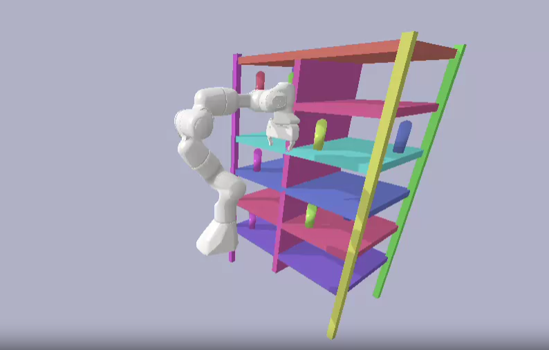

- Get a point cloud from a transparent object in real time.

  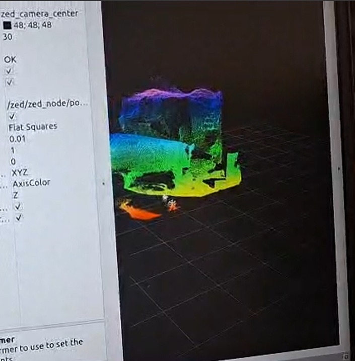
  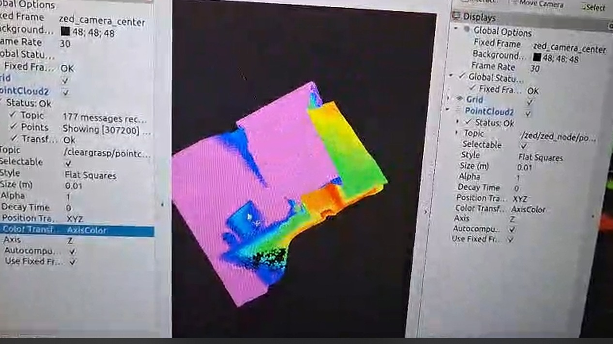

**In Progress:**

- Stabilize the follow-face module in real time.
- Implement VAMP in the manipulation pipeline.
- TDP 2026 paper.
- Simulation: MuJoCo, receptionist environment.

## 2025-10-09

**Done:**

- Tested xArm with joint trajectory controller.
- Get a point cloud from a transparent object.
- Inspect the pipeline and manage exceptions in each step.

**In Progress:**

- Unify movement control through ROS only.
- Stabilize the follow-face module in real time.
- TDP 2026 paper.
- Simulation: MuJoCo, receptionist environment.

## 2025-10-02

**Done:**

- Added FRIDA's URDF to MuJoCo.

  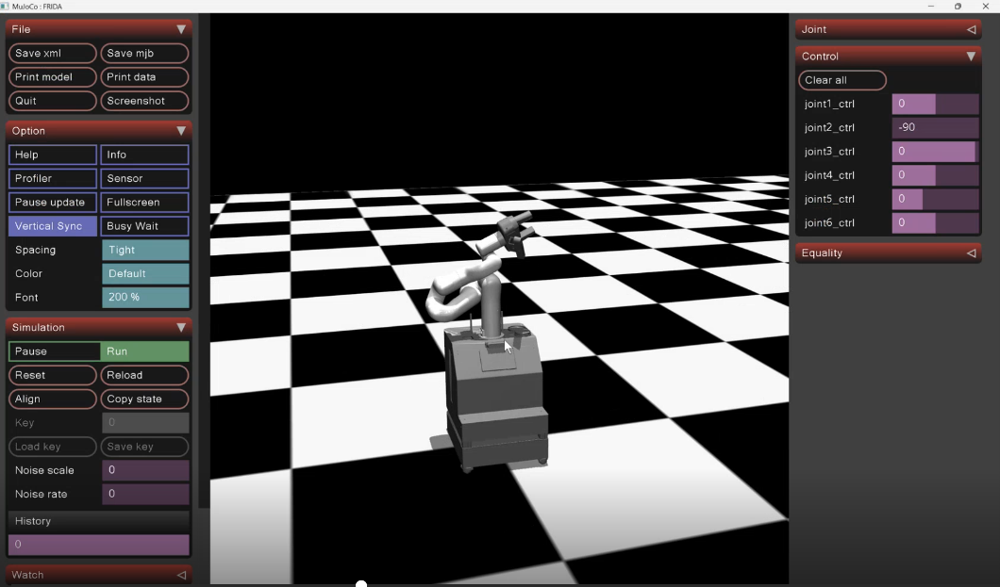

- Tests with clear grasps.

  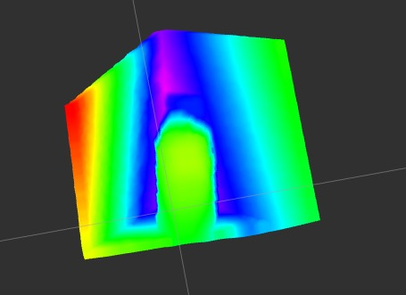

- Onboarding.

**In Progress:**

- Unify movement control through ROS only.
- Inspect the pipeline and manage exceptions in each step.
- Stabilize the follow-face module in real time.
- Remake the follow-person module to improve reliability and accuracy.
- TDP 2026 paper.
- Simulation: MuJoCo, receptionist environment.

## 2025-09-26

**Done:**

- Tried ClearGrasp with the RealSense D435i camera.
- Mini onboarding.

**In Progress:**

- Unify movement control through ROS only.
- Inspect the pipeline and manage exceptions in each step.
- Stabilize the follow-face module in real time.
- Remake the follow-person module to improve reliability and accuracy.
- TDP 2026 paper.
- Simulation: MuJoCo, add FRIDA URDF, receptionist environment, multi-person sim.

## 2025-09-18

**News:** new member, Hector Tovar.

**Done:**

- Investigation on how to detect a transparent container.

  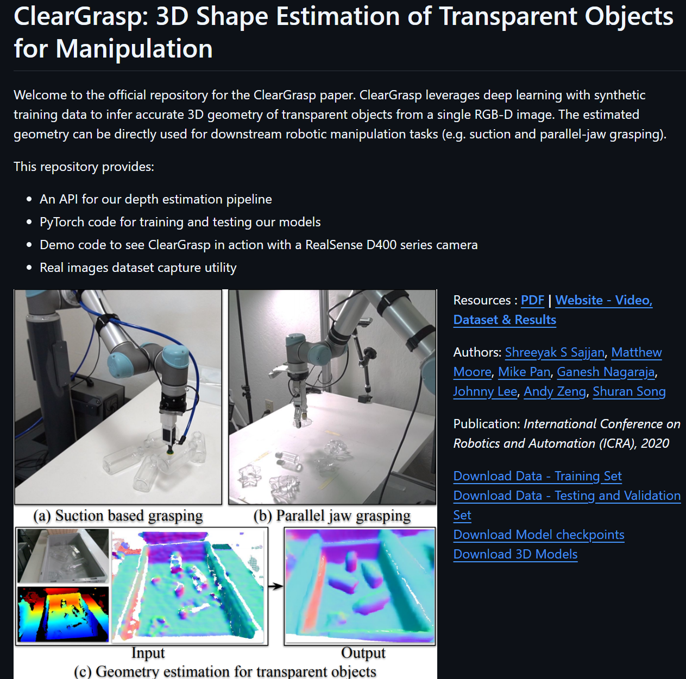

- Optimize downsampling and clustering to improve speed and accuracy on detected objects.

  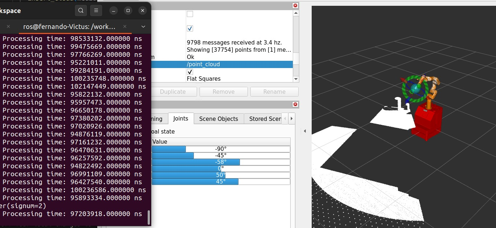
  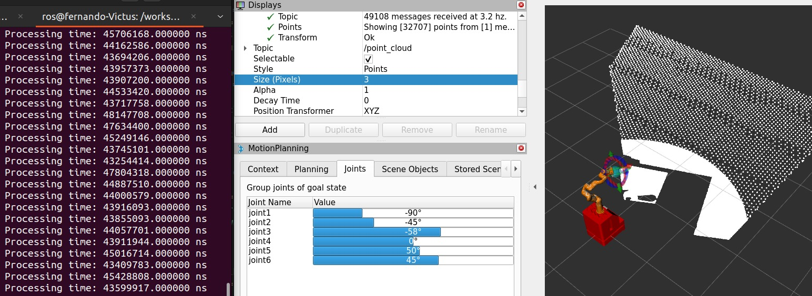

- Testing MuJoCo for simulation.

  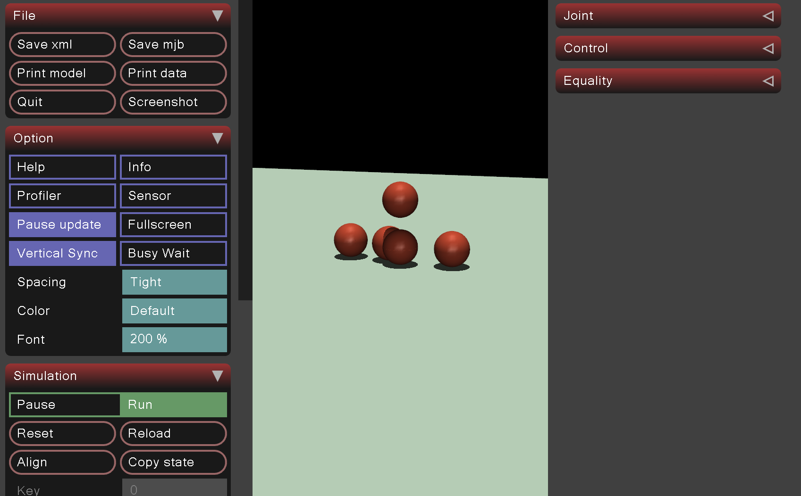

**In Progress:**

- Unify movement control through ROS only.
- Inspect the pipeline and manage exceptions in each step.
- Stabilize the follow-face module in real time.
- Remake the follow-person module to improve reliability and accuracy.
- TDP 2026 paper.
- Simulation: MuJoCo, add FRIDA URDF, receptionist environment, multi-person sim.

## 2025-07-05

**Done:**

- Added environment spherization to avoid collisions near the object to pick.
- Increased pipeline reliability (fixed many hanging issues).
- Tuned GPD for the new gripper; better success rate.
- Fully tested for the Storing Groceries task.

**In Progress:**

- Trajectory recording to file.
- Trajectory projection.
- Serving cereal on container, real-robot tests.

## 2025-06-25

**News:** new members, Paola Llamas and Emil Winkler.

**Done:**

- Onboarding.
- Tested new GPDs; decided to keep the current one.
- Pointcloud resolution scaled by distance to points.

**In Progress:**

- Decided on a proposal to open doors using recorded trajectories adjusted for new observations.
- Clustering door handles.
- Serving cereal on container.

## 2025-04-24, TMR

This entry covers the last week of April and developments right before and during TMR 2025.

**News:** TMR 2025 finished; the manipulation team had **one successful pick** in the rounds.

**Done:**

- Place on shelves.
- New gripper fully tested and upgraded over the previous pipeline.
- Added both vertical and horizontal grasping pose generation, tuned for the new gripper.
- Fixed URDF precision issues.
- Tests with navigation and within task managers.

## 2025-04-24

**News:** Pick & Place on historic prime.

**Done:**

- Place pipeline developed:
    - Adaptable to any object size and table height.
    - Incorporated within the pick code structure and ROS node, easy to use, develop, and scale.
    - Tested on simulation and real robot.
- Heatmap extraction for place position (developed for RoboCup 2024 but never used; works far better than the previous KNN clustering).

  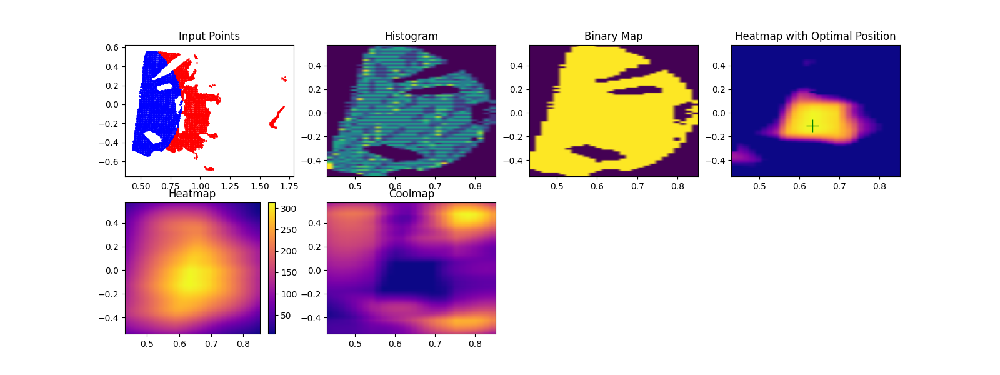

- Pick & Place fully tested in real life:
    - Massive speed improvements from collision-object generation, reduced use of octomap and collision meshes, and tuning of GPD-estimated grasp poses.
    - Planning times: MoveIt (TMR 2023, TDP 2024) > 1 min · Cartesian (TMR 2024, RoboCup 2024) ~20 s · new MoveIt pipeline (TMR 2025) ~10 s.
    - Octomap integrated within the perception pipeline → safer pick/place.
    - Integrated into the subtask manager for GPSR and Storing Groceries.
- New URDF for simulation and real robot:
    - Fixed for use on simulation.
    - Fixed an issue that shifted the point cloud ~3 cm from its real position.
- Give-&-take operations for the task manager.
- Improved face follower.
- Documentation and easy-to-use launches for the pick & place pipeline.

<iframe width="560" height="315" src="https://www.youtube.com/embed/VFtXomtwfvM" title="Pick and Place tests April 24, 2025" frameborder="0" allowfullscreen></iframe>

**In Progress:**

- Picking big objects reliably.
- Storing Groceries, placing on a difficult surface with high collision risk.
- Plane extraction for the table collision object, tuning for more scenarios.

## 2025-04-10

**Done:**

- Added simulation with real robot's ZED camera and gripper, working in 2D and 3D.
- Fixed transform-time issues when deploying scripts on simulation (e.g. object detector).
- Integrated the full pick pipeline with the 2D object detector on simulation; refactor for scalability.
- Tested pipeline on the real robot with the ZED camera:
    - Sim-to-real was smooth, no logic changes.
    - Heavy topics moved to *Best Effort* QoS, enabling real-robot tests over Wi-Fi.
    - Robot could not pick due to pending URDF changes.
- Face follow tested and working.
- New poses for Carry My Luggage and Receptionist.

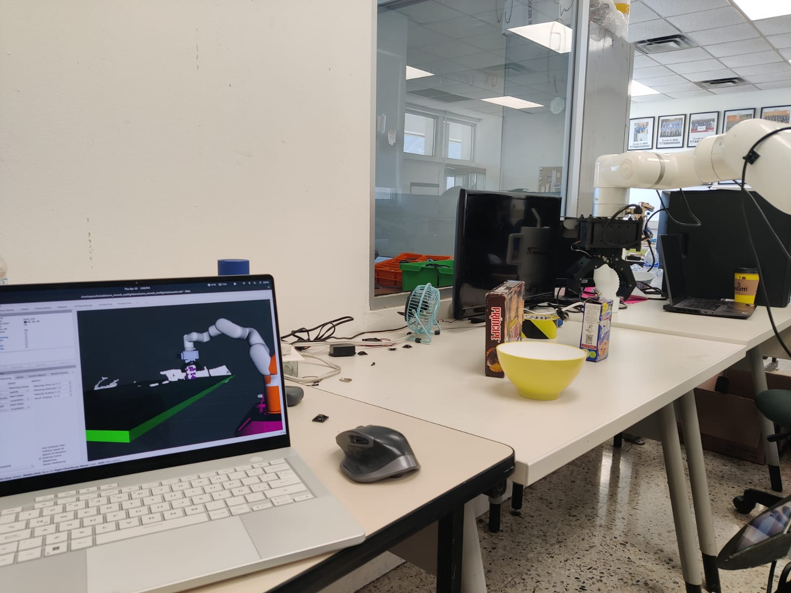

**In Progress:**

- CuRobo environment setup.
- Three issues on Receptionist runs:
    - Planning hangs on the custom `planning_server`.
    - `GetJoints` service may return all zeros.
    - MoveIt sometimes doesn't flag all-zero positions as invalid.
- Place pipeline with all services added.
- URDF quality-of-life changes.

## 2025-04-03

**Done:**

- Cleaned up task manager; readied remaining items for Receptionist.
- Fixed collision objects colliding among themselves.
- Heatmap for getting place position.

**In Progress:**

- CuRobo worked on PCs; Orin environment not ready.
- Listed candidate GPDs; some tested and discarded (e.g. SamsungLabs, picks on unusable poses, ignores gripper geometry).
- Placing-object pipeline advances.

**Notes:** slow week; the @Home manipulation team is known for rising from the ashes like a phoenix.

## 2025-03-27

This entry covers both weeks from 2025-03-07 to 2025-03-20.

**News:** first pick of the year.

**Done:**

- Successful tests on simulation and real life, zero sim-to-real code changes.
- GPD connection to ROS 2.
- 2D detection handler to ease use of 2D object detection.
- Documentation on running pick & place methods and all nodes for Receptionist.

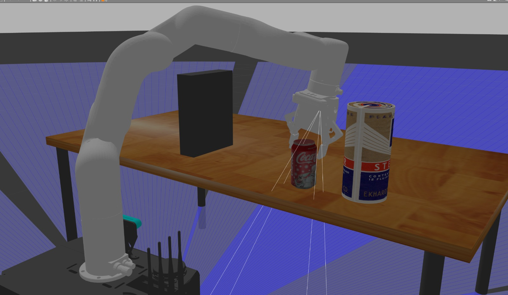

**In Progress:**

- Next-phase planning: new motion planning methods, faster 3D perception, constrained planning, task-specific work.
- Place methods and tests.
- Acceleration of perception_3d.
- Looking for new GPDs.

**Notes:**

- Pick-pipeline additions show a significant improvement in planning time, from several minutes to under 10 seconds.
- Starting the SOTA phase to improve every area of the pipeline.

## 2025-03-20

This entry covers both weeks from 2025-03-07 to 2025-03-20.

**News:** early results on the March-15 demo.

**Done:**

- Pick server (motion planning to pick objects).
- Manipulation Core (communicates with detector, GPD, and pick server).
- Manipulation Server (external interface, task manager ↔ manipulation core).
- 2D object detector with 3D point extraction.
- 3D object extraction, clustering and mesh reconstruction. New method: reconstruct the table as a box and the object as a set of spheres instead of a mesh, accelerates planning.
- Gazebo simulation and MoveIt config ready.
- Octomap working on ZED input.
- Pick using 3D object extraction + pick server.

**In Progress:**

- Grasp-pose detection ROS 2 connection.
- Service to handle updating recent detections (avoid many subscribers).
- Detection + GPD integration in Manipulation Core.
- Next-phase planning (as above).

**Notes:**

- MoveIt 2 has no real benefits over MoveIt 1 except constrained planning. Primitive object reconstruction is expected to fix old planning-time issues.
- Code so far has been reworked from scratch (not migrated from `home-manipulation`) for maintainability and flexibility.

## 2025-03-06

**Done:**

- 2D object detector working in 2D (no 3D yet).
- Refactored motion planning and object-detector code.
- DashGo MoveIt config working.
- Gripper working with `xarm_api`.
- Action servers and services for most motion-planning tasks (plan, execute, collision objects).
- Demo for scholarships.

**In Progress:**

- 2D → 3D projection.
- 3D object extraction (clustering and mesh reconstruction).
- Full pick-pipeline tests.
- Grasp-pose detection.
- Octomap from ZED input.
- Gazebo simulation.

**Notes:** on track for good results on March 15.

## 2025-02-27

**News:** new team member, Ricardo Guerrero. Team for the Feb–May period (9 members, the largest so far): Iván Romero Wells, José Luis Domínguez, David Vázquez, Alexis Chapa, Alejandro González, Ricardo Guerrero, Gerardo Fregoso, Yair Reyes, Emiliano Flores.

**Done:**

- Table / surface extraction migrated.
- MoveIt 2 interface in Python integrated within the subtask manager.

**In Progress:**

- 2D object detection and extraction.
- 3D object extraction (clustering and mesh reconstruction).
- Pick & Place server for motion planning.

**Notes:** a pick & place demo is scheduled for March 15, marking the start of the next phase (new motion-planning methods, accelerated 3D perception).
