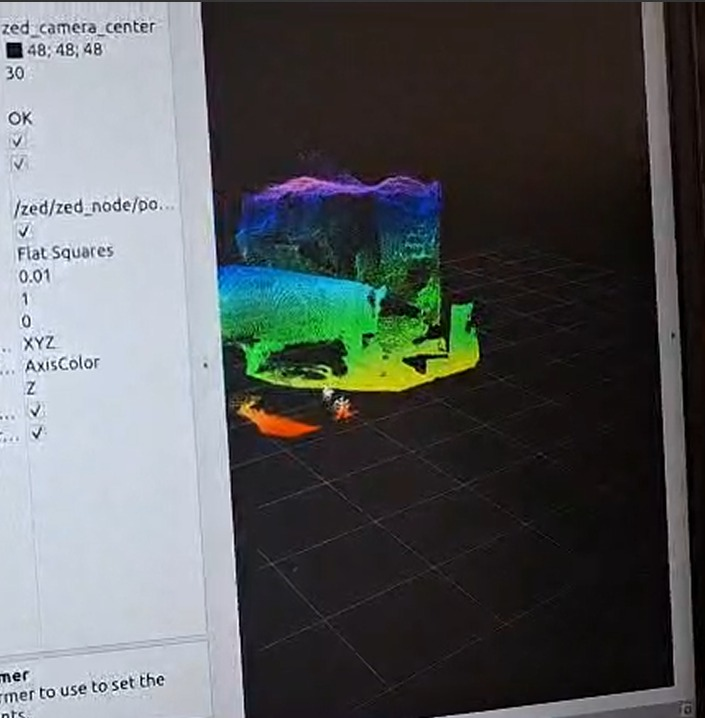

# Weekly Spotlights

This page is a collection of weekly spotlights that highlight the progress of the Object Manipulation team. Each spotlight is a summary of the work done by the team in a week.

Member status:

- 🔍: Research
- 💻: Development
- 📝: Documentation
- 🔄: Refactoring
- 🔧: Bug fixing
- 🤝: Participation in other subteam

## 2026-01-15

| Name     | Status     |
| -------- | ------     |
| Domínguez|  💻📝    |
| Ale G.   |  📝     | 
| Ricardo  |  💻      |
| Fernando |  💻        |
| Luis     |  💻       |
| Emil     |  💻📝     |
| Fregoso  |              |
| Paola    |  📝     |
| Hector   |  💻     |
| Efrain   |  💻     |

**Done:**
- Fist manipulation meeting of 2026

**In Progress:**
- Fixing the TDP2026 paper
- Getting cluster of transparent objects
- Working on simulation

## 2025-11-21

| Name     | Status     |
| -------- | ------     |
| Domínguez|  💻📝    |
| Ale G.   |  📝     | 
| Ricardo  |  💻      |
| Fernando |  💻📝        |
| Luis     |  💻📝        |
| Emil     |  💻📝🔍     |
| Fregoso  |              |
| Paola    |  📝     |
| Hector   |  💻     |

**Main Priority:**

- Add all the developments to the TDP2026 paper

**Done:**

-  Place objects around other objects (e.g. place cup at the right of zucaritas box)
-  Fixed repository dev/manipulation in the jetson orin

**In Progress:**

- Working on the TDP2026 paper
- Correct and stabilize the follow face module to work in real time
- Working on place trash action
- Working on pick error
- Fix octomap logic issues
- Handle Exceptions in the manipulation pipeline
- Implement vamp into the manipulation pipeline
- Simulation:
    - Mujoco: Add the environment of the receptionist to Mujoco

| Person | Assigned Tasks |
| :--- | :--- |
| **Domínguez** | `TDP2026 paper`, `Vamp integration`, `Mujoco environment` |
| **Ale G.** | `TDP2026 paper` |
| **Ricardo** | `Follow face module` |
| **Fernando** |`Pick error`|
| **Luis** |  `Octomap fix`, `Handle Exceptions` |
| **Emil** | `TDP2026 paper`, `Place trash action` |
| **Paola** | `TDP2026 paper` |
| **Fregoso** | *(Pending)* |
| **Hector** | `Detect transparent objects` |

## 2025-11-14

| Name     | Status     |
| -------- | ------     |
| Domínguez|  💻📝    |
| Ale G.   |  📝     | 
| Ricardo  |  💻      |
| Fernando |  💻📝        |
| Luis     |  💻📝        |
| Emil     |  💻📝🔍     |
| Fregoso  |              |
| Paola    |  📝     |
| Hector   |         |

**Main Priority:**

- Add all the developments to the TDP2026 paper

**Done:**

- No major advances this week

**In Progress:**

- Working on the TDP2026 paper
- Correct and stabilize the follow face module to work in real time
- Working on place trash action
- Working on pick error
- Fix octomap logic issues
- Handle Exceptions in the manipulation pipeline
- Implement vamp into the manipulation pipeline
- Simulation:
    - Mujoco: Add the environment of the receptionist to Mujoco

| Person | Assigned Tasks |
| :--- | :--- |
| **Domínguez** | `TDP2026 paper`, `Vamp integration`, `Mujoco environment` |
| **Ale G.** | `TDP2026 paper` |
| **Ricardo** | `Follow face module` |
| **Fernando** |`Pick error`, `Detect transparent objects`|
| **Luis** |  `Octomap fix`, `Handle Exceptions` |
| **Emil** | `TDP2026 paper`, `Place trash action` |
| **Paola** | `TDP2026 paper` |
| **Fregoso** | *(Pending)* |
| **Hector** | *(Pending)* |

## 2025-11-07

| Name     | Status     |
| -------- | ------     |
| Domínguez|  💻📝    |
| Ale G.   |  💻📝     | 
| Ricardo  |  💻📝       |
| Fernando |  💻📝        |
| Luis     |  💻📝        |
| Emil     |  💻📝🔍     |
| Fregoso  |  💻📝       |
| Paola    |  📝 🔍     |
| Hector   |  💻📝       |

**Done:**

- Tested xarm sim with vamp

**In Progress:**

- Correct and stabilize the follow face module to work in real time
- Implement vamp into the manipulation pipeline
- Working on the TDP2026 paper
- Simulation:
    - Mujoco: Add the environment of the receptionist to Mujoco

## 2025-10-16

| Name     | Status     |
| -------- | ------     |
| Domínguez|  💻📝    |
| Ale G.   |  💻📝     | 
| Ricardo  |  💻📝       |
| Fernando |  💻📝        |
| Luis     |  💻📝        |
| Emil     |  💻📝🔍     |
| Fregoso  |  💻📝       |
| Paola    |  📝 🔍     |
| Hector   |  🤝         |

### Done
- Unify movement control using only ROS (e.g. joint_trajectory) and delete manual modes in runtime.
- Test with vamp

- Get point cloud from a transparent object in real time

| Before | After |
| :---: | :---: |
|  |  |

### In Progress
- Correct and stabilize the follow face module to work in real time
- Implement vamp into the manipulation pipeline
- Working on the TDP2026 paper
- Simulation:
    - Mujoco
        - Add the environment of the receptionist to Mujoco

## 2025-10-09

| Name     | Status     |
| -------- | ------     |
| Domínguez|  💻📝    |
| Ale G.   |  💻📝     | 
| Ricardo  |  💻📝       |
| Fernando |  💻📝        |
| Luis     |  💻📝        |
| Emil     |  💻📝🔍     |
| Fregoso  |  💻📝       |
| Paola    |  📝 🔍     |
| Hector   |  🤝         |

### Done
- Test xarm with joint trajectory controller
- Get point cloud from a transparent object
- Inspect the pipeline and manage correctly the exceptions in each step

### In Progress
- Unify movement control using only ROS (e.g. joint_trajectory) and delete manual modes in runtime.
- Correct and stabilize the follow face module to work in real time
- Working on the TDP2026 paper
- Simulation:
    - Mujoco
        - Add the environment of the receptionist to Mujoco

## 2025-10-02

| Name     | Status     |
| -------- | ------     |
| Domínguez|  💻 📝    |
| Ale G.   |  💻📝     | 
| Ricardo  |  💻       |
| Fernando |  💻        |
| Luis     |  💻        |
| Emil     |  💻 🔍     |
| Fregoso  |  💻       |
| Paola    |  📝 🔍     |
| Hector   |  🤝         |

### Done
- Added the urdf of Frida to Mujoco

- Tests with clear grasps

- Onboarding

### In Progress
- Unify movement control using only ROS (e.g. joint_trajectory) and delete manual modes in runtime.
- Inspect the pipeline and manage correctly the exceptions in each step
- Correct and stabilize the follow face module to work in real time
- Remake the follow person module to improve the reliability and accuracy
- Working on the TDP2026 paper
- Simulation:
    - Mujoco
        - Add the environment of the receptionist to Mujoco

## 2025-09-26

| Name     | Status     |
| -------- | ------     |
| Domínguez|  💻 📝    |
| Ale G.   |  💻📝     | 
| Ricardo  |  💻       |
| Fernando |  💻        |
| Luis     |  💻        |
| Emil     |  💻 🔍     |
| Fregoso  |  💻       |
| Paola    |  📝 🔍     |
| Hector   |  🤝         |

### Done
- Already tried ClearGrasp with the realsense d435i camera
- Mini OnBoarding 

### In Progress
- Unify movement control using only ROS (e.g. joint_trajectory) and delete manual modes in runtime.
- Inspect the pipeline and manage correctly the exceptions in each step
- Correct and stabilize the follow face module to work in real time
- Remake the follow person module to improve the reliability and accuracy
- Working on the TDP2026 paper
- Simulation:
    - Mujoco
        - Add the urdf of Frida
        - Add the environment of the receptionist to Mujoco
        - Make a way that allow us to enter more than two people to different simulations

## 2025-09-18
### News
New member:
- Hector Tovar

| Name     | Status     |
| -------- | ------     |
| Domínguez|  💻 📝    |
| Ale G.   |  💻📝     | 
| Ricardo  |  💻       |
| Fernando |  💻        |
| Luis     |  💻        |
| Emil     |  💻 🔍     |
| Fregoso  |  💻       |
| Paola    |  📝 🔍     |
| Hector   |  🤝         |

### Done
- Investigation on how to detect a transparent container

- Optimize the downsampling and clustering to improve the speed and accuracy in detected objects

| Before | After |
| :---: | :---: |
|  |  |

<!--   -->
- Testing MuJoco for simulation

### In Progress
- Unify movement control using only ROS (e.g. joint_trajectory) and delete manual modes in runtime.
<!-- - Simplify and standardize the API to make it more intuitive and less prone to errors -->
- Inspect the pipeline and manage correctly the expceptions in each step
- Correct and stabilize the follow face module to work in real time
- Remake the follow person module to improve the reliability and accuracy
- Working on the TDP2026 paper
- Simulation:
    - Mujoco
        - Add the urdf of Frida to Mujoco
        - Add the environment of the receptionist to Mujoco
        - Make a way that allow us to enter more than two people to different simulations

## 2025-07-05

### Done
- Added environment spherization to avoid collisions near the object to pick
- Increased pipeline reliability (fixed lots of hanging issues)
- Tuned GPD for new gripper, now has a better success rate
- Fully tested for storing groceries task

### In Progress
- Trajectory recording as a file
- Trajectory projection
- Serving cereal on container real robot tests

## 2025-06-25

### News
New members:
- Paola Llamas
- Emil Winkler

### Done
- Onboarding
- Tested new GPDs, decided to keep the current one
- Pointcloud resolution based on distance to points

### In Progress
- Decided on proposal to open doors, using recorded trajectories and adjusting for new observations
- Clustering door handles
- Serving cereal on container

## 2025-04-24 ---> TMR
This includes both weeks last week from april and developments right before and during TMR 2025.

### News
TMR2025 finished, manipulation team had ONE SUCCESFUL PICK on rounds.

### Done

- Place on shelfs done
- New gripper fully tested and upgraded over previous pipeline
- Added both vertical and horizontal grasping poses generation, tuned for new gripper
- Fixed URDF precision issues
- Tests with navigation and within task managers

## 2025-04-24

### News
- Pick & Place on historic prime

### Done
- Place pipeline developed
    - Has adaptability for any object size and table height
    - Incorporated within pick code structure and ROS node, making it easy to use, develop and scale
    - Tested on simulation and real robot
- Heatmap extraction for place position
    - Developed for Robocup 2024 but never used, works far better than previous KNN clustering

- Pick and Place fully tested on real life
    - Massive improvements on speed, obtained from collision object generation, reducing use of octomap and collision meshes and tuning GPD estimated grasp poses
    - Planning times in comparison:
        - Original MoveIt Pipeline (TMR2023, TDP2024): >1 minute
        - Cartesian Planning (no collision detection, inferior working distance) (TMR2024, Robocup2024): ~20s
        - New Moveit Pipeline (TMR2025): ~10s
    - Octomap integrated within perception pipeline, enabling very safe pick and place operations
    - Integrated on subtask manager for GPSR and Storing Groceries
- New URDF for Simulation and Real robot
    - Fixed for use on simulation
    - Fixed a big issue which caused the pointcloud to be shifted ~3cm from its real position
- Give & take operations for task manager
- Improved face follower
- Documentation and new easy to use launches for pick & place pipeline

<iframe width="560" height="315" src="https://www.youtube.com/embed/VFtXomtwfvM" title="Pick and Place tests April 24, 2025" frameborder="0" allowfullscreen></iframe>

### In Progress
- Robot still has issues picking big objects
- Storing Groceries task involves placing on a difficult surface and at a high risk of colliding, which requires further testing
- Plane extraction to generate a collision object for the table requires tuning to be working on a wider range of scenarios

## 2025-04-10

### News
- No news

### Done
- Added simulation with real robot's ZED camera and gripper, working with 2D and 3D camera
- Fixed transform time issues when deploying some scripts on simulation e.g. object detector.
- Integrated the full pick pipeline with object detector 2D on simulation. Refactored the code to make it easier to use and to scale better for new tasks.
- Tested pipeline on real robot with ZED camera
    - Once again, sim-to-real was smooth without any logic changes
    - Adjustements were made so all our heavy topics use "Best Effort" QoS policy which made real-robot tests possible -> receiving images and pointclouds through WiFi.
    - Robot was not able to pick the object as some URDF changes are yet to be added.
- Face follow tested and working.
- New poses for Carry my Luggage and Receptionist

### In Progress
- CuRobo environment setup
- Three issues were detected on Receptionist runs:
    - Sometimes, planning hangs on the custom planning_server, not detecting planning failed and not returning a result.
    - GetJoints service may return all 0s.
    - MoveIt did not notics position all 0s as invalid even when it's on collision
- Place pipeline with all services added.
- URDF QoL changes.

## 2025-04-03

### News
- No news

### Done
- Cleaned up task manager, got some remaining things ready for receptionist
- Fixed an issue where collision objects were collising among themselves
- Heatmap for getting place position

### In Progress
- CuRobo worked on PCs, environment on the Orin is not ready yet.
- List of GPDs ready, some already tested and discarded (SamsungLabs)
    - Reason: Picks on unusable poses e.g. below the object, and has no way of taking as input the characteristics of the gripper.
- Advances on the placing object pipeline.

### Notes
- Slow week but the @Home manipulation team is known for rising from the ashes like a phoenix.

## 2025-03-27
This includes both weeks from 2025-03-07 to 2025-03-20

### News
- No news

### Done
- Cleaned up task manager, got some remaining things ready for receptionist
- Fixed an issue where collision objects were collising among themselves
- Heatmap for getting place position

### In Progress
- CuRobo worked on PCs, environment on the Orin is not ready yet.
- List of GPDs ready, some already tested and discarded (SamsungLabs)
    - Reason: Picks on unusable poses e.g. below the object, and has no way of taking as input the characteristics of the gripper.
- Advances on the placing object pipeline.

### Notes
- Slow week but the @Home manipulation team is known for rising from the ashes like a phoenix.

## 2025-03-27
This includes both weeks from 2025-03-07 to 2025-03-20

### News
- First pick of the year

### Done
- Succesful tests on simulation and real life ---> not a line of code modified on sim2real
- GPD connection to ROS2
- 2D Detection handler to ease use of 2d object detection
- Documentation on running pick and place methods and all nodes necessary for receptionist

Pick on Simulation:

### In Progress
- Planning of the next phase of the project:
    - New motion planning methods
    - Accelerating 3D perception
    - Constrained Planning
    - Task-specific work
- Place methods and tests 
- Accelerating perception 3D methods
- Looking for new GPDs

### Notes
- Our additions to the pick pipeline show a SIGNIFICANT improvement in planning time, from several minutes to less than 10 seconds. 
- We will begin the SOTA phase to improve all areas of the pipeline:
    - Faster Motion planning
    - Optimized Motion Planning
    - Better GPDs

---

## 2025-03-20
This includes both weeks from 2025-03-07 to 2025-03-20

### News
- We got early results on the March 15th demo. 

### Done
- Pick server, which handles all motion planning to pick objects
- Manipulation Core, that communicates with detector, GPD and pick server
- Manipulation Server, which communicates external systems e.g. task manager, with the manipulation core
- Object detector 2D with 3D point extraction
- Object 3D extraction -> Clustering and mesh reconstruction
    - We added a new method to accelerate planning by reconstructing the table as a box and the object as a set of spheres instead of a mesh
- Gazebo simulation and moveit config seem to be all ready to use
- Octomap working now on ZED input
- Pick using 3D object extraction and pick server
 
### In Progress
- Grasping pose detection connection to ROS2
- Service to handle updating recent detections to avoid subscribers on many nodes
- Integration of detection and GPD on Manipulation Core
- Planning of the next phase of the project:
    - New motion planning methods
    - Accelerating 3D perception
    - Constrained Planning
    - Task-specific work 

### Notes
- Moveit2 seems to have no real benefits over Moveit1 apart from the constrained planning feature. We expect other changes, such as the primitive object reconstruction to solve old planning time issues.
- All code so far has not been migrated to ROS2 from its version on home-manipulation, but reworked and replanned for better maintainability and flexibility.

---

## 2025-03-06

### News
- no news

### Done
- Object Detector 2D working with 2D, no 3D yet
- Refactored Motion Planning and Object Detector code
- Dashgo moveit config working
- Working gripper with xarm_api
- Working Action Services and services for most motion planning tasks (plan, execute, collision objects)
- Demo for scholarships (??)
 
### In Progress
- Object 2D projection to 3D
- Object 3D extraction -> Clustering and mesh reconstruction
- Full pick pipeline tests
- Grasping pose detection
- Working octomap from zed input
- Gazebo simulation 

### Notes
- We seem to be on track for good results on March 15th :)

---

## 2025-02-27

### News
- Welcoming new team member: Ricardo Guerrero
- New team for the February-May period:
    * Iván Romero Wells
    * José Luis Dominguez
    * David Vázquez
    * Alexis Chapa
    * Alejandro González
    * Ricardo Guerrero
    * Gerardo Fregoso
    * Yair Reyes
    * Emiliano Flores

This is the largest team we have had so far, with 9 members.

### Done
- Table/Surface extraction migrated
- MoveIt2 interface on Python integrated within subtask manager
### In Progress
- Object 2D detection and extraction
- Object 3D extraction -> Clustering and mesh reconstruction
- Pick and Place server for motion planning

### Notes
- A pick and place demo has been scheduled for March 15th, which will mark the start of development into the next phase of the project, involving new motion planning methods and accelerating 3D perception.
- A pick and place demo has been scheduled for March 15th, which will mark the start of develoomoent into the next phase of the project, involving new motion planning methods and accelerating 3D perception.
