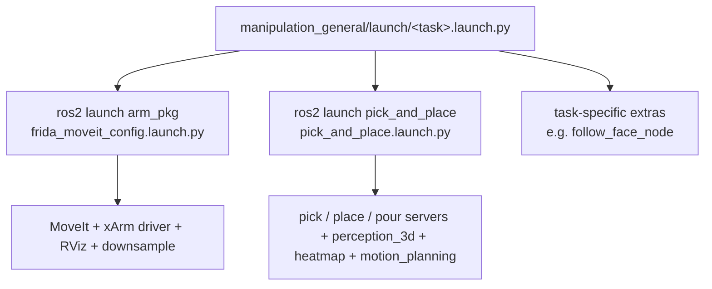

# Running Tasks

Practical guide to **launching** the manipulation stack and **sending** picks / places / pours. Everything below assumes you have already followed [Setup & Build](setup.md) and you are inside the manipulation container (`./run.sh manipulation`).

!!! abstract "Quickstart"
    1. `./run.sh vision` *(in another terminal)* — start vision so detections flow.
    2. `./run.sh manipulation --ppc` — bring up MoveIt + the full pick/place stack.
    3. Place an object on the table.
    4. `ros2 run pick_and_place keyboard_input.py` — open the interactive picker.
    5. Type the number of the detection or its label — the robot picks it.

## Launch hierarchy

There is one base launch for the arm + perception, and one for the pick/place stack. Every competition task is just a composition of those two.



=== "Just the arm"

    ```bash
    ros2 launch arm_pkg frida_moveit_config.launch.py
    ```

=== "Pick stack only (MoveIt already up)"

    ```bash
    ros2 launch pick_and_place pick_and_place.launch.py
    ```

=== "Full task launch"

    ```bash
    ros2 launch manipulation_general gpsr.launch.py
    ```

### Most useful launch arguments

#### `pick_and_place.launch.py`

| Argument | Default | When to change |
|---|---|---|
| `use_sim_time` | `false` | Set `true` for MuJoCo (switches every node to `/clock`). |
| `point_cloud_topic` | `/point_cloud` | Use `/filtered_cloud` in MuJoCo (the MoveIt self-filtered topic). |

#### `frida_moveit_config.launch.py`

| Argument | Default | Notes |
|---|---|---|
| `robot_ip` | `192.168.31.180` | Real arm IP. Change to your subnet. |
| `show_rviz` | `true` | RViz config with planning scene + grasp markers. |
| `clean_logs` | `true` | Sets `ROS_LOG_LEVEL=WARN` to hide MoveIt INFO spam. |
| `add_gripper` | `false` | Set `true` only if using the UFactory gripper (we have our own). |
| `kinematics_suffix` | `""` | Selects IK plugin variant (e.g. IKFast). |

## From the host: `./run.sh` shortcuts

Each competition task has a one-liner that enters the container and runs the right launch:

```bash
./run.sh manipulation --gpsr            # GPSR
./run.sh manipulation --ppc             # Pick & Place Challenge
./run.sh manipulation --restaurant      # Restaurant
./run.sh manipulation --carry           # Carry My Luggage
./run.sh manipulation --hric            # Human-Robot Interaction Challenge
```

Each maps to `ros2 launch manipulation_general <task>.launch.py` — see [`docker/manipulation/run.sh`](https://github.com/RoBorregos/home2/blob/main/docker/manipulation/run.sh) for the exact dispatch.

## First pick — end to end

!!! example "Walkthrough"
    **1. Make sure vision is up** *(separate container — `./run.sh vision`)*. You need either:

    - `/vision/detection_handler` service (for known objects), or
    - `ZERO_SHOT_DETECTIONS_TOPIC` (for open-set detection).

    **2. Bring up manipulation:**

    ```bash
    ros2 launch manipulation_general ppc.launch.py
    ```

    Wait until you see:

    - `Manipulation Core has been started`
    - `pick_server`, `place_server`, `pour_server` reporting ready
    - `gpd_service` logging the loaded GPD config

    **3. Place an object** on the table in front of the robot, between 0.4 m and 1.0 m.

    **4. In a new terminal in the same container**, run the interactive shell:

    ```bash
    ros2 run pick_and_place keyboard_input.py
    ```

    **5. Select an object** from the list (or type a label not yet detected — it will be sent regardless).

If you do not have vision, see [Picking without vision](#picking-without-vision).

## Interactive keyboard tool { #interactive-keyboard-tool }

`keyboard_input.py` is the standard developer interface to the manipulation server. It subscribes to detections, prints a menu, and sends `ManipulationAction` goals.

Example output:

```
Available objects:
1. bottle
2. cup
3. fork
-2. Refresh objects list
-3. Place
-4. Place on shelf
-5. Place on shelf (with plane height)
-6. Pour
-7. Place on clicked point
-8. Place closeto
-9. Special Request Place
-10. Pour (object already grasped)
-11. Pick from shelf (keep octomap)
q. Quit
```

### Menu reference

| Choice | Action | Maps to |
|---|---|---|
| `1..N` | Pick the *N*-th listed detection. | `ManipulationTask.PICK` |
| _free text_ | Pick by exact label (even if not yet detected). | `ManipulationTask.PICK` |
| `-2` | Refresh detections (subscribes for 1 s). | — |
| `-3` | Place — heatmap chooses the spot. | `ManipulationTask.PLACE` |
| `-4` | Place on shelf — keeps the octomap, `is_shelf=True`. | `ManipulationTask.PLACE` |
| `-5` | Place on shelf at a specific height. | `place_params.table_height` + `table_height_tolerance` |
| `-6` | Pour — type the object name and bowl name. | `ManipulationTask.POUR` |
| `-7` | Place at an RViz "Publish Point" click. | `place_params.forced_pose` |
| `-8` | Place close to another known object. | `place_params.close_to` |
| `-9` | Special-request place — `close` / `front` / `back` / `left` / `right`. | `place_params.special_request` (JSON) |
| `-10` | Pour with `object_already_grasped=True`. | `pour_params.object_already_grasped` |
| `-11` | Pick from a shelf (scans the environment first). | `scan_environment=True` |

### Distance filter

```bash
ros2 run pick_and_place keyboard_input.py \
    --ros-args -p min_distance:=0.0 -p max_distance:=1.5
```

Detections outside `[min_distance, max_distance]` (in meters, distance to arm base) are dropped before listing.

## Picking from code

The minimal contract is: build a `ManipulationAction.Goal`, send it, await the result.

```python
import rclpy
from rclpy.node import Node
from rclpy.action import ActionClient
from frida_interfaces.action import ManipulationAction
from frida_interfaces.msg import ManipulationTask
from frida_constants.manipulation_constants import MANIPULATION_ACTION_SERVER


class MyTask(Node):
    def __init__(self):
        super().__init__("my_task")
        self.client = ActionClient(self, ManipulationAction, MANIPULATION_ACTION_SERVER)

    def pick(self, label: str, scan_env: bool = False):
        goal = ManipulationAction.Goal()
        goal.task_type = ManipulationTask.PICK
        goal.pick_params.object_name = label
        goal.pick_params.min_distance = 0.0
        goal.pick_params.max_distance = 1.5
        goal.scan_environment = scan_env
        self.client.wait_for_server()
        return self.client.send_goal_async(goal)
```

For `PLACE`, set `goal.task_type = ManipulationTask.PLACE` and fill `goal.place_params`. For `POUR`, fill `goal.pour_params` (`object_name`, `bowl_name`, optional `object_already_grasped`).

!!! example "Complete reference client"
    [`pick_and_place/tests/call_pick_action.py`](https://github.com/RoBorregos/home2/blob/main/manipulation/packages/pick_and_place/pick_and_place/tests/call_pick_action.py).

## Lower-level motion calls

Sometimes you only want to move the arm — no perception, no grasp planning. Use `motion_planning_server` directly.

=== "Joint goal — by name"

    Easiest path, using the Python helper:

    ```python
    from frida_motion_planning.utils.service_utils import move_joint_positions

    move_joint_positions(
        move_joints_action_client=self._move_joints_client,
        named_position="table_stare",   # see xarm_configurations.py
        velocity=0.3,
    )
    ```

=== "Joint goal — numeric"

    ```python
    from frida_interfaces.action import MoveJoints
    from frida_constants.manipulation_constants import DEG2RAD

    goal = MoveJoints.Goal()
    goal.joint_positions = [j * DEG2RAD for j in [-90, -45, -90, 0, 0, 45]]  # FRONT_STARE
    goal.velocity = 0.3
    ```

    !!! warning
        `MoveJoints.action` has no `named_position` field. Name lookup happens in the
        Python helper before sending the goal.

=== "Pose goal"

    ```python
    from frida_interfaces.action import MoveToPose
    from geometry_msgs.msg import PoseStamped

    goal = MoveToPose.Goal()
    goal.pose.header.frame_id = "link_base"
    goal.pose.pose.position.x = 0.4
    goal.pose.pose.position.y = 0.0
    goal.pose.pose.position.z = 0.3
    goal.pose.pose.orientation.w = 1.0
    goal.velocity = 0.2
    goal.target_link = "link_eef"      # or gripper_grasp_frame
    goal.planner_id = ""               # let server pick (RRTConnect)
    ```

    Working example: [`call_pose_goal.py`](https://github.com/RoBorregos/home2/blob/main/manipulation/packages/frida_motion_planning/examples/call_pose_goal.py).

=== "Gripper"

    ```python
    from frida_motion_planning.utils.service_utils import close_gripper, open_gripper

    close_gripper(client)   # SetBool data=True
    open_gripper(client)    # SetBool data=False
    ```

    Service: `/manipulation/gripper/set_state`. Booleans only — the gripper has no force control. `pick_server` detects contact via joint effort in mode 5.

### Named joint configurations

Defined in `frida_constants/xarm_configurations.py`. Use by name with `move_joint_positions(named_position="...")`.

| Name | Purpose |
|---|---|
| `FRONT_STARE` | Default front-facing pose (HRI, GPSR resting). |
| `FRONT_LOW_STARE` | Slightly downward — receptionist, presenting. |
| `TABLE_STARE` | Looks at the table — pick start pose. |
| `CUTLERY_STARE` | Closer look at the table — pre-cutlery pick. |
| `PICK_STARE_AT_TABLE` | Alternative to `TABLE_STARE` for taller surfaces. |
| `NAV_POSE` | Compact pose while navigating. |
| `NAV_CARRY_BAG_POSE` | Compact pose while carrying a bag. |
| `CARRY_POSE` | Holding a bag/object for delivery. |
| `RECEIVE_OBJECT` | Posture for an HRI handover from a person. |
| `HAND_BAG_POSE` | Searching for a hand to give a bag to. |
| `PLACE_FLOOR_LEFT`, `PLACE_FLOOR_RIGHT` | Placing a bag on the floor. |
| `SCAN_FLOOR_CARRY_BAG_POSE` | Scanning low for a bag during carry. |

## Picking without vision { #picking-without-vision }

`manipulation_client.py` listens to `/clicked_point` (RViz "Publish Point" tool) and forwards it as a pick request:

```bash
ros2 run pick_and_place manipulation_client.py
```

Click the cluster in RViz → the server treats that as the object centroid → perception + GPD run from there → motion. Useful when vision is down or you are testing perception and motion in isolation.

## Picking cutlery (forks, knives, spoons)

Cutlery uses a different sub-pipeline. **No special flag** — if the requested `object_name` is in `CUTLERY_NAMES = ["fork", "knife", "spoon", "cutlery"]`, `PickManager` automatically takes the cutlery path:

1. Move to `cutlery_stare`.
2. Subscribe to `/manipulation/flat_grasp_pose` (`flat_grasp_estimator.py`, top-down PCA-aligned grasp).
3. Average 10+ samples for Z stability.
4. Send the averaged pose to `pick_server`.
5. **Force-guarded descent**: xArm enters mode 5, descends at `CUTLERY_DESCENT_SPEED = 20 mm/s`, aborts when joint effort exceeds `CUTLERY_EFFORT_THRESHOLD = 6.5 N`.

??? abstract "Tuning knobs (`pick_server.py`)"

    ```python
    CUTLERY_DESCENT_SPEED        = 20.0   # mm/s
    CUTLERY_EFFORT_THRESHOLD     = 6.5    # N
    CUTLERY_DESCENT_TIMEOUT      = 10.0   # s
    CUTLERY_PRE_GRASP_HEIGHT     = 0.15   # m
    CUTLERY_EFFORT_GRACE_PERIOD  = 0.5    # s (ignore initial spike)
    CUTLERY_POST_CONTACT_RETRACT = 0.002  # m
    ```

    - **Hits too hard?** Raise `CUTLERY_PRE_GRASP_HEIGHT` or lower `CUTLERY_EFFORT_THRESHOLD`.
    - **Stops before touching?** Raise the threshold.

## Picking from a shelf

Use `goal.scan_environment = True` (option `-11` in the keyboard tool). This:

1. **Skips** the `clear_octomap` call.
2. Sweeps `joint1` by `±SCAN_ANGLE_HORIZONTAL` and `joint5` by `±SCAN_ANGLE_VERTICAL` to build the octomap of the shelf.
3. Runs the normal pick pipeline with the octomap intact.

Returned grasp will be horizontal if the object pose suggests it (taller than wider).

## Placing — `place_params` field reference

| Field | Meaning |
|---|---|
| `is_shelf` | If true, keep the octomap and don't go to `table_stare` first. |
| `table_height`, `table_height_tolerance` | Override the detected plane height (meters). Useful for fixed shelves. |
| `close_to` | A known object label — the heatmap will bias the place point near it. |
| `special_request` | JSON, e.g. `{"request":"close_by","object":"box","position":"left"}`. |
| `forced_pose` | Skip the heatmap entirely and use this pose. |

The heatmap result is published on `/manipulation/table_place_point_debug`. The corresponding place EE pose lands on `/manipulator/place_ee_link_pose`. **Visualise both** in RViz before debugging the planner.

## Pouring

Two modes:

=== "Pick then pour (default)"

    `object_already_grasped=False`. The server picks the source object first, then pours into the bowl, then keeps it attached for a follow-up place.

=== "Already grasped"

    `object_already_grasped=True`. Skips the pick — useful when chained from a previous `PICK`.

!!! info "Upright-pick objects"
    The source object must be in `POUR_OBJECT_NAMES = {"blue_cereal_box", "cereal", "chocomilk_box", "milk"}` to be picked **upright** instead of with GPD's best guess.

## Diagnostic commands

```bash
# List the action servers and their states
ros2 action list -t
ros2 action info /manipulation/manipulation_action_server

# Watch goal feedback
ros2 topic echo /manipulation/manipulation_action_server/_action/feedback

# Force-clear the octomap
ros2 service call /clear_octomap std_srvs/srv/Empty

# Move the arm to a joint goal (joints in radians)
ros2 action send_goal /manipulation/move_joints_action_server frida_interfaces/action/MoveJoints \
  "{joint_positions: [-1.57, -0.78, -1.57, 0.0, 0.0, 0.78], joint_names: [], velocity: 0.3, acceleration: 0.0}"

# Open / close gripper
ros2 service call /manipulation/gripper/set_state std_srvs/srv/SetBool "{data: false}"   # open
ros2 service call /manipulation/gripper/set_state std_srvs/srv/SetBool "{data: true}"    # close
```

## Debugging recipe

When something goes wrong, walk through this checklist before diving into logs:

??? question "Did the action even arrive?"
    `ros2 action info /manipulation/manipulation_action_server` should show your client. If not, you probably imported the wrong constant — make sure you used `MANIPULATION_ACTION_SERVER` from `frida_constants`.

??? question "Is perception failing?"
    Watch `/manipulation/table_place_point_debug` and the cluster extraction logs. If the cluster is wrong, look at `add_primitives.cpp` parameters. If the plane is tilted, look at `remove_plane.cpp`.

??? question "GPD returns nothing?"
    Confirm `gpd_service` is alive (`ros2 node list | grep gpd`). Verify the configured `.cfg` path — the **testing** cfg has higher rejection. Check `/gpd_service` logs for the score distribution.

??? question "MoveIt fails to plan?"
    The octomap may be polluted by a stale cloud. Clear it:

    ```bash
    ros2 service call /clear_octomap std_srvs/srv/Empty
    ```

??? question "Pick succeeds but lift fails?"
    The attached collision object overlaps the world. Confirm in RViz that the attached primitive size is correct. If too big, tune `add_primitives.cpp`.

??? question "Place places nowhere or always at the same point?"
    The heatmap input cloud is probably not in `base_link`. Check the frame_id on the cloud topic.

For the canonical list of issues over the past months, browse [Spotlights](spotlights.md).
