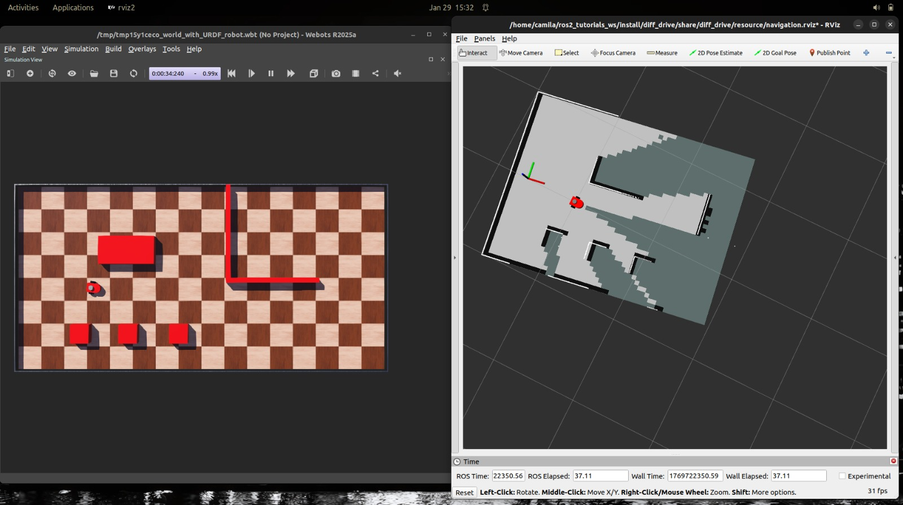
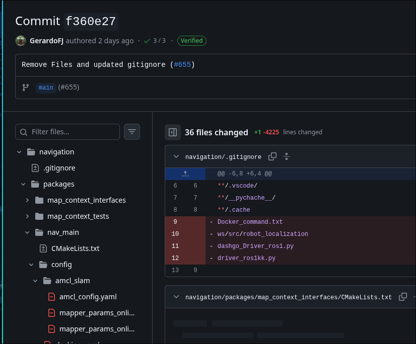

# Weekly Spotlights

This page is a collection of weekly spotlights that highlight the progress of the integration team. Each spotlight is a summary of the work done by the team in a week.

Member status:

- 🔍: Research
- 💻: Development
- 📝: Documentation
- 🔄: Refactoring
- 🔧: Bug fixing
- 🤝: Participation in other subteam

## 2026-01-29

 Name     | Status |
| -------- | ------ |
| Camila   |   💻   |
| Bahena   |   🔍   |
| Fregoso  |   💻   |
| Rodro    |   💻   |
| Daniel   |   💻   |
| Alberto  |   🔍   |
| Dana     |   🔍   |

- **Research**

  - New members are learning about nav2 repo and behaivor trees.

- **Development**

  - Webots first status simulation.
  
  - Webots zed2 digital twin.
  - Cleanup repository
  
  - Updating Performance for Nodes migrating to cpp.
  - Tauri app development in progress
  

## 2026-01-22

 Name     | Status |
| -------- | ------ |
| Camila   |   📝   |
| Bahena   |   🔍   |
| Fregoso  |    🔄  |
| Rodro    |   📝   |
| Daniel   |   🤝   |
| Alberto  |   🔍   |
| Dana     |   🔍   |

- **Research**

  - New members are learning about nav2 introduction with Articulated Robotics videos.

- **Refactor**

  - Removing old stuff and updating packages.

 **Documentation**

  - Creating first tauri app documentation.
  - Documenting first takes with webots simulation.