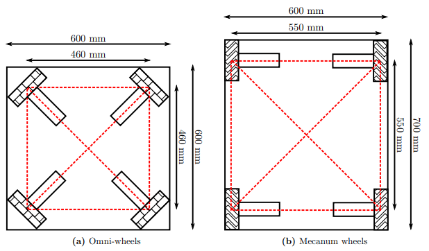
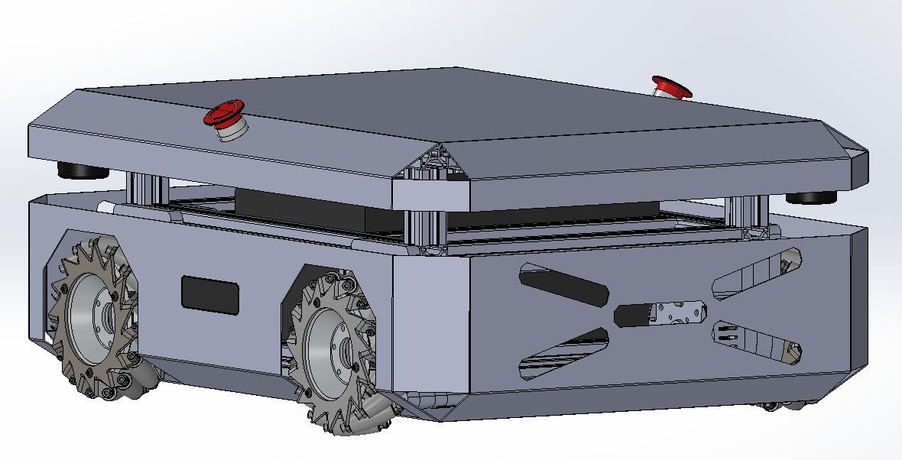
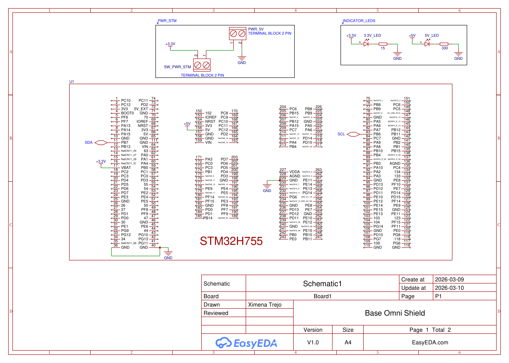
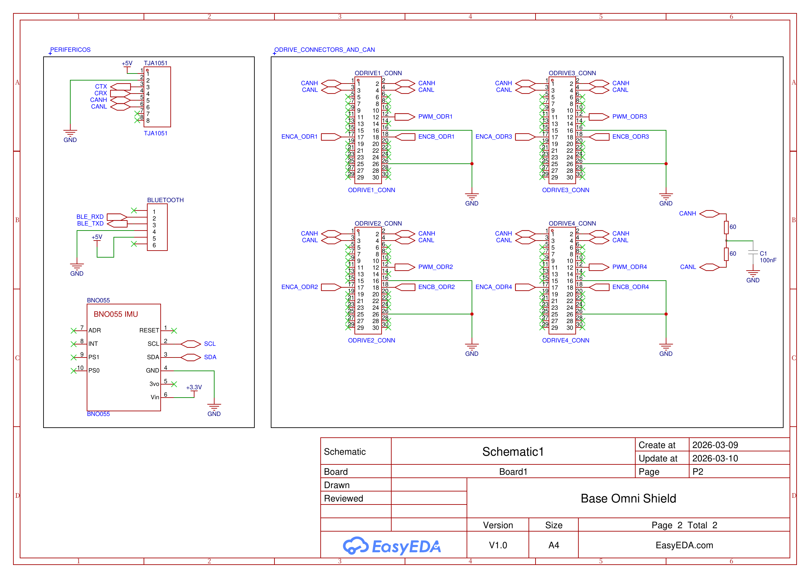

# Omnibase Overview

This section documents the design and implementation of a custom holonomic base for FRIDA, a significant hardware upgrade intended to replace the DashGo differential drive platform currently in use.

## Motivation

The DashGo platform, while functional, imposes constraints on the robot's navigation flexibility. Transitioning to a custom holonomic base offers several key advantages:

- **Omnidirectional movement** — the robot can translate in any direction without rotating, enabling smoother and more precise maneuvers in tight or dynamic indoor environments.
- **Full mechanical ownership** — being entirely designed and built by the team allows complete control over the platform's architecture, facilitating future improvements and adaptations tailored to competition requirements.
- **Improved integration** — custom electronics and mechanical structure allow a tighter integration between the base, the arm, and the rest of the robot's systems.

---

## Mechanical Design

### Wheel Selection: Mecanum vs Omni

An early design decision was whether to use **mecanum wheels** or **omni wheels**. Both achieve holonomic motion but differ in their trade-offs:

| Feature | Mecanum Wheels | Omni Wheels |
|---|---|---|
| Vibration & stability | Lower vibration, greater stability | More vibration |
| Space efficiency | Larger footprint (wheels offset 45°) | Smaller footprint |
| Push force | Greater in all directions | Lower |
| Max velocity | Moderate | Higher |
| Heavy load applications | Preferred | Less suitable |
| Cramped space navigation | Moderate | Better |

After evaluating competition requirements — particularly the need to carry loads and operate reliably — **mecanum wheels were selected** as the preferred choice.

<p align="center">
  
</p>
<p align="center" style="font-size:small"><i>Space efficiency comparison between omni-wheels and mecanum wheels</i></p>

### CAD Design

The base structure uses **4040 aluminum extrusion profiles** as the main chassis frame. Motors are mounted with custom-designed motor mounts that adapt the actuator attachment to the extrusion profile geometry.

<p align="center">
  
</p>
<p align="center" style="font-size:small"><i>Proof-of-concept CAD model of the omnibase</i></p>

---

## Actuator System: ODrive S1 + BLDC Motors

Each of the four wheels is driven by a brushless DC motor paired with an **ODrive S1** motor controller, following a quasi direct drive (QDD) approach inspired by the [OpenQDD project](https://www.aaedmusa.com/projects/openqdd).

### ODrive S1

The [ODrive S1](https://docs.odriverobotics.com/v/latest/hardware/s1-datasheet.html) is a compact, high-performance FOC (Field-Oriented Control) motor controller designed for robotics applications.

| Parameter | Value |
|---|---|
| DC bus voltage range | 12 V – 48 V (12S LiPo max) |
| Continuous phase current | 40 A (with heat spreader) |
| Continuous power output | 1600 W |
| PCB footprint | 66 mm × 50 mm |
| Mass | 35 g (55 g with screw terminals) |
| Communication | CAN (isolated, daisy-chain), UART, USB-C |
| Onboard absolute encoder | Yes — no homing required on startup |
| Control modes | Torque, velocity, position, trajectory |

**Key features for this application:**

- **Galvanically isolated CAN bus** with daisy-chain connectors (J16/J17), allowing all 4 S1s to share a single CAN bus to the main controller without ground loop issues.
- **Onboard absolute encoder** eliminates the need for homing routines when the robot powers on.
- **Compact form factor** (smaller than a credit card) makes it feasible to mount directly on the base chassis.

The four ODrive S1 units are connected in a CAN daisy-chain, all communicating with the central STM32H755 microcontroller using the **CANSimple protocol**.

---

## Electronics & Control Architecture

The control PCB is the central hub of the omnibase, designed entirely by the team. It interfaces the main computer with the four motor controllers and onboard sensors.

### Control PCB

The schematic was designed in EasyEDA (V1.0) by Ximena Trejo. Full schematic PDF available [here](../../assets/development/omnibase/rev2_baseomni_shield.pdf).

<p align="center">
  
</p>
<p align="center" style="font-size:small"><i>Base Omni Shield Rev 2 — Page 1: STM32H755 pinout</i></p>

<p align="center">
  
</p>
<p align="center" style="font-size:small"><i>Base Omni Shield Rev 2 — Page 2: TJA1051, BNO055, BLE module and ODrive connectors</i></p>

### Key Components

| Component | Interface | Role |
|---|---|---|
| **STM32H755** | — | Dual-core (Cortex-M7 + Cortex-M4) main microcontroller; handles CAN communication, odometry, and BLE |
| **BNO055** | I2C (SCL/SDA) | 9-DOF IMU (accelerometer, gyroscope, magnetometer) for orientation and odometry fusion; powered at 3.3V |
| **TJA1051** | CAN (CTX/CRX) | CAN bus transceiver; interfaces the STM32 CAN peripheral with the physical CAN bus to the 4 ODrive S1s; powered at 5V |
| **BLE Module** | UART (BLE_RXD/BLE_TXD) | Bluetooth Low Energy module for wireless gamepad connectivity; 6-pin connector, powered at 5V |
| **ODrive connectors ×4** | 30-pin | Per ODrive: CANH/CANL, PWM, encoder channels A+B (ENCA/ENCB), GND |
| **CAN termination** | — | 2×60Ω resistors in series (= 120Ω) with 100nF capacitor to GND, per CAN bus standard |
| **Power input** | Terminal block 2-pin | PWR_5V input with power switch (SW_PWR_STM); 3.3V and 5V indicator LEDs onboard |

### Communication Topology

```
[Main Computer]
      |
    [STM32H755]
      |  (CAN via TJA1051 — CANH/CANL)
      +——[ODrive S1 #1]  ← CANH, CANL, PWM, ENCA, ENCB
      +——[ODrive S1 #2]  ← CANH, CANL, PWM, ENCA, ENCB
      +——[ODrive S1 #3]  ← CANH, CANL, PWM, ENCA, ENCB
      +——[ODrive S1 #4]  ← CANH, CANL, PWM, ENCA, ENCB
                                    [120Ω + 100nF termination]

      + [BNO055]     (I2C — SCL/SDA)
      + [BLE Module] (UART — BLE_RXD/BLE_TXD)
```

The STM32H755 acts as the bridge between the high-level computer (running ROS 2) and the low-level motor controllers. It sends velocity/torque commands over CAN to each ODrive S1, and also routes PWM and encoder signals (ENCA/ENCB) per motor. IMU data from the BNO055 is read over I2C for odometry fusion.

The PCB was designed in **EasyEDA (V1.0)** by Ximena Trejo, created and updated on 2026-03-09/10.

---

## Software & Repository

The firmware and ROS 2 integration code for the omnibase is maintained in the team's repository:

- **GitHub:** [RoBorregos/home-custom-base](https://github.com/RoBorregos/home-custom-base)

The repository includes:
- STM32 firmware (CAN configuration, ODrive control functions, odometry)
- ROS 2 nodes for base velocity commands and odometry publishing
- Configuration and calibration utilities

---

## References

- [OpenQDD — Open-source Quasi Direct Drive Actuator](https://www.aaedmusa.com/projects/openqdd)
- [ODrive S1 Datasheet](https://docs.odriverobotics.com/v/latest/hardware/s1-datasheet.html)
- [Design Notes & Research Document](https://docs.google.com/document/d/1QnDMYmi6xfbKK6lK678KZRYBli9W_Uak3yHbTfzW1rE/edit?tab=t.0#heading=h.cye0jhos70dd)
- K. Kanjanawanishkul, "Omnidirectional wheeled mobile robots: wheel types and practical applications," *International Journal of Advanced Mechatronic Systems*, vol. 6, no. 6, p. 289, 2015.
- Mo. Massoud et al., "Mechatronic Design and Path planning optimization for an Omni wheeled mobile robot for indoor applications," *ICCTA*, 2021.