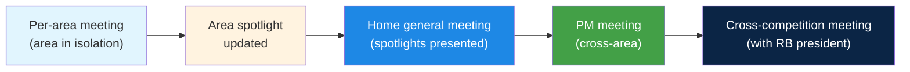

# Cadence

The PM's rhythm is measured weekly and yearly. The week is built from meetings that repeat; the year is organized around TMR, RoboCup, TDP, and demos. This page is the reference for what happens when.

## The four weekly meetings

Home runs **four distinct meetings every week**. None of them are optional. The cadence is what keeps the team synchronized and the spotlights alive.

### 1. Home general meeting

| | |
|---|---|
| **Attendees** | All Home members, general PMs, area PMs |
| **Facilitator** | General PMs |
| **Duration** | 60 to 90 minutes |
| **Frequency** | Once a week, fixed day |

Each area PM presents the area's spotlight: what they did, what is in progress, what is blocking them. This is the moment where cross-area dependencies surface in real time.

!!! tip "The spotlight gets presented, not invented"
    If an area PM shows up without an update prepared, that is already a miss. The spotlight should have been updated during the area's own weekly meeting **before** the general meeting.

### 2. Per-area meeting

| | |
|---|---|
| **Attendees** | Area PM and area members |
| **Facilitator** | Area PM |
| **Duration** | 45 to 60 minutes |
| **Frequency** | Once a week, different day from the general meeting |

This is where work actually gets assigned, technical questions get resolved, and the area's spotlight gets written. The general meeting is the summary; the area meeting is where the real work happens.

Suggested agenda:

1. **Round-robin updates** (3 to 5 minutes per member).
2. **Blockers**. Who needs what to keep going.
3. **Task assignment** for the coming week.
4. **Spotlight wrap-up**. Write down what gets presented in the general meeting.

### 3. PM meeting

| | |
|---|---|
| **Attendees** | General PMs and area PMs |
| **Facilitator** | General PMs |
| **Duration** | About 45 minutes |
| **Frequency** | Once a week |

No regular members. This is where we discuss:

- **Cross-area blockers** that need API or timeline negotiation between areas.
- **Purchase requests** that an area PM wants to push upward.
- **Member issues** that the area PM cannot resolve alone.
- **Changes to the macro timeline**.

### 4. Cross-competition meeting

| | |
|---|---|
| **Attendees** | Home general PMs, leads of Home Maze, Soccer, etc., RoBorregos team president |
| **Facilitator** | RoBorregos team president |
| **Duration** | 45 to 60 minutes |
| **Frequency** | Weekly or every two weeks |

This meeting coordinates across sister competitions: shared budget, team events, press, sponsor visits. Only the general PMs attend (not the area PMs).

!!! info "You are not in the room, but it affects you"
    Decisions taken here can change Home's calendar or budget. Ask the general PMs for a summary in the next PM meeting.

### Visual summary



## Spotlights: who writes them and how

Spotlights live in this site (Home-Docs) under the **Weekly Spotlights** section of each area.

### Who writes them

Two patterns both work. Each area picks the one that fits.

=== "Pattern A. PM consolidates"

    The area PM writes the spotlight from what was discussed in the
    weekly area meeting.

    **Pro**: consistent style, easy to read.
    **Con**: all the work lands on the PM.

=== "Pattern B. Members write their own"

    Each member writes their own bullets (in Slack, in a Google Doc,
    or directly in the PR). The PM consolidates and publishes.

    **Pro**: distributes the work; members get used to documenting.
    **Con**: inconsistent style; the PM has to edit.

!!! tip "Recommendation"
    Use a mix. Ask members to send you one to three bullets in Slack at the end of their area meeting. You consolidate and publish. It takes ten minutes, spreads the work, and the members' bullets show up in the repo (which motivates them).

### When to publish

The spotlight for week N gets published **before** the general meeting that same week. The point of the general meeting is to present what is already written, not to draft it live.

### Style

There is a single style for Home (see `docs/development/manipulation/spotlights.md` as the reference):

```markdown
## YYYY-MM-DD

**Done:**

- **Owner** 💻 short description of the task.
- **Owner** 💻 another task.

**In Progress:**

- **Owner** 💻 description.

**Notes / News (optional):**

- New members, events, etc.
```

Emojis next to the owner: 💻 development, 📝 docs, 🔍 research, 🔧 bug fix, 🔄 refactor, 🤝 cross-area.

## Yearly calendar

The big milestones a Home PM has to plan around. Dates below are taken from the 2025-2026 cycle. Confirm the current year's dates on the [RoboCup @Home Call for Participation page](https://athome.robocup.org/call-for-participation/).

```mermaid
gantt
    title Yearly calendar (based on the 2025-2026 cycle)
    dateFormat YYYY-MM-DD
    axisFormat %b

    section Recruiting + onboarding
    Candidates event              : 2025-08-25, 2025-10-31
    Selection + welcoming         : 2025-10-31, 2025-11-15
    Per-area onboarding (varies)  : 2025-11-15, 2026-01-15

    section RoboCup early call
    Call published                : milestone, 2025-10-07, 0d
    Intention deadline            : milestone, 2025-10-31, 0d
    TDP / video / website         : milestone, 2025-11-30, 0d
    Qualification announcement    : milestone, 2025-12-23, 0d
    Participation confirmation    : milestone, 2026-01-23, 0d

    section RoboCup late call
    Call published                : milestone, 2026-01-09, 0d
    Intention deadline            : milestone, 2026-02-03, 0d
    TDP / video / website         : milestone, 2026-02-10, 0d
    Qualification announcement    : milestone, 2026-03-06, 0d
    Participation confirmation    : milestone, 2026-04-06, 0d

    section Competitions
    TMR (national, around April)  : crit, 2026-04-01, 2026-04-30
    Junior migration window opens : milestone, 2026-04-30, 0d
    RoboCup 2026                  : crit, 2026-06-30, 2026-07-06

    section Ongoing
    Saturday demos                : 2025-11-15, 2026-07-06
    PM handoff (before they leave): milestone, 2026-08-01, 0d
```

### RoboCup @Home call deadlines

The official source is [athome.robocup.org/call-for-participation](https://athome.robocup.org/call-for-participation/). There are typically two windows; teams aim for whichever fits their TDP readiness.

| Stage | Early call | Late call |
|---|---|---|
| Call for Participation published | Oct 7, 2025 | Jan 9, 2026 |
| Submission of participation intention | Oct 31, 2025 | Feb 3, 2026 |
| Submission of qualification material (TDP, video, website) | Nov 30, 2025 | Feb 10, 2026 |
| Qualification announcement | Dec 23, 2025 | Mar 6, 2026 |
| Participation confirmation | Jan 23, 2026 | Apr 6, 2026 |

### TMR (around April)

The national competition. Exact date varies year to year, but it has happened in April in recent cycles. Confirm the current year's date with the general PMs.

For PMs the rule of thumb is: anything that lands in the last few weeks before TMR has to be a bug fix or a polish, not a new feature. Pushing a new feature two weeks before the competition is the most common cause of avoidable failures.

### RoboCup 2026

In **2026 the dates are June 30 to July 6**. The location and exact schedule are published on the [RoboCup site](https://2026.robocup.org/).

To attend the international competition the team has to qualify by submitting the **TDP, team video, and team website** by the deadline of either the early or late RoboCup @Home call (see the table above). Once qualified, the team needs to confirm participation by the corresponding date and then plan travel.

For PMs:

- **International logistics** (visas, flights, lodging) take months. Start them as soon as qualification is announced (December for the early call, March for the late call).
- **Hardware packed and inspected twice** before the trip. Pack spares.

### TDP (Team Description Paper)

The yearly paper that documents Home's system. It is a required deliverable for RoboCup; without it you do not qualify.

- **Structure**: each area writes its section. The length is whatever the call requires that year.
- **Lead**: general PMs coordinate; area PMs write their sections.
- **Timing**: pick the call you are targeting and work back from there. For the early call the TDP is due Nov 30; for the late call it is due Feb 10.
- **Where to submit**: through the upload portal on the [RoboCup @Home Call for Participation page](https://athome.robocup.org/call-for-participation/).

### Demos and presentations

The team runs **demos on Saturdays**. The reason is practical: on weekdays the lab tends to be busy and not clean enough to set up the task scenarios properly. Saturday gives space and quiet to run a real end-to-end demo without people bumping into the robot.

Demos happen for several audiences over the year (sponsors, the school, advanced candidates, internal press). The exact schedule of who comes to which Saturday is coordinated with the general PMs and the team president.

As a PM you should **always have a demo-ready version of the robot**. That is what communicates progress to the outside. Keep a working version separate from the one that is actively in development.
