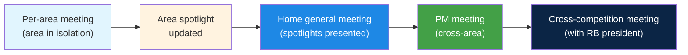
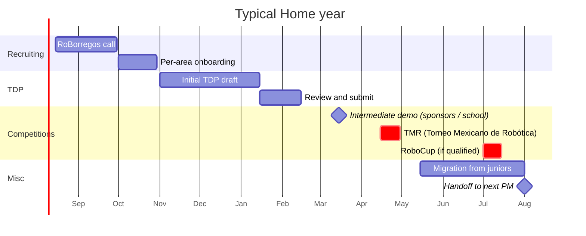

# Cadence

The PM's rhythm is measured weekly and yearly. The week is built from meetings that repeat; the year is organized around TMR, RoboCup, TDP, and demos. This page is the reference for what happens when.

## The four weekly meetings

Home runs **four distinct meetings every week**. None of them are optional. The cadence is what keeps the team synchronized and the spotlights alive.

### 1. Home general meeting

| | |
|---|---|
| **Attendees** | All Home members, general PMs, area PMs |
| **Facilitator** | General PMs |
| **Duration** | 60 to 90 minutes |
| **Frequency** | Once a week, fixed day |

Each area PM presents the area's spotlight: what they did, what is in progress, what is blocking them. This is the moment where cross-area dependencies surface in real time.

!!! tip "The spotlight gets presented, not invented"
    If an area PM shows up without an update prepared, that is already a miss. The spotlight should have been updated during the area's own weekly meeting **before** the general meeting.

### 2. Per-area meeting

| | |
|---|---|
| **Attendees** | Area PM and area members |
| **Facilitator** | Area PM |
| **Duration** | 45 to 60 minutes |
| **Frequency** | Once a week, different day from the general meeting |

This is where work actually gets assigned, technical questions get resolved, and the area's spotlight gets written. The general meeting is the summary; the area meeting is where the real work happens.

Suggested agenda:

1. **Round-robin updates** (3 to 5 minutes per member).
2. **Blockers**. Who needs what to keep going.
3. **Task assignment** for the coming week.
4. **Spotlight wrap-up**. Write down what gets presented in the general meeting.

### 3. PM meeting

| | |
|---|---|
| **Attendees** | General PMs and area PMs |
| **Facilitator** | General PMs |
| **Duration** | About 45 minutes |
| **Frequency** | Once a week |

No regular members. This is where we discuss:

- **Cross-area blockers** that need API or timeline negotiation between areas.
- **Purchase requests** that an area PM wants to push upward.
- **Member issues** that the area PM cannot resolve alone.
- **Changes to the macro timeline**.

### 4. Cross-competition meeting

| | |
|---|---|
| **Attendees** | Home general PMs, leads of Home Maze, Soccer, etc., RoBorregos team president |
| **Facilitator** | RoBorregos team president |
| **Duration** | 45 to 60 minutes |
| **Frequency** | Weekly or every two weeks |

This meeting coordinates across sister competitions: shared budget, team events, press, sponsor visits. Only the general PMs attend (not the area PMs).

!!! info "You are not in the room, but it affects you"
    Decisions taken here can change Home's calendar or budget. Ask the general PMs for a summary in the next PM meeting.

### Visual summary



## Spotlights: who writes them and how

Spotlights live in this site (Home-Docs) under the **Weekly Spotlights** section of each area.

### Who writes them

Two patterns both work. Each area picks the one that fits.

=== "Pattern A. PM consolidates"

    The area PM writes the spotlight from what was discussed in the
    weekly area meeting.

    **Pro**: consistent style, easy to read.
    **Con**: all the work lands on the PM.

=== "Pattern B. Members write their own"

    Each member writes their own bullets (in Slack, in a Google Doc,
    or directly in the PR). The PM consolidates and publishes.

    **Pro**: distributes the work; members get used to documenting.
    **Con**: inconsistent style; the PM has to edit.

!!! tip "Recommendation"
    Use a mix. Ask members to send you one to three bullets in Slack at the end of their area meeting. You consolidate and publish. It takes ten minutes, spreads the work, and the members' bullets show up in the repo (which motivates them).

### When to publish

The spotlight for week N gets published **before** the general meeting that same week. The point of the general meeting is to present what is already written, not to draft it live.

### Style

There is a single style for Home (see `docs/development/manipulation/spotlights.md` as the reference):

```markdown
## YYYY-MM-DD

**Done:**

- **Owner** 💻 short description of the task.
- **Owner** 💻 another task.

**In Progress:**

- **Owner** 💻 description.

**Notes / News (optional):**

- New members, events, etc.
```

Emojis next to the owner: 💻 development, 📝 docs, 🔍 research, 🔧 bug fix, 🔄 refactor, 🤝 cross-area.

## Yearly calendar

These are the big milestones a Home PM should plan around.



### TMR (April / May)

The national competition. It is the critical deadline of the first semester. For PMs:

- **Three months out**: feature freeze. Only bug fixes and polish.
- **Six weeks out**: cross-area integration is mandatory. Every area tests with the others.
- **Two weeks out**: tests in the closest possible match to the real arena.
- **One week out**: logistics (travel, lodging, hardware, spare parts).

!!! warning "If you do not qualify at TMR, you do not go to RoboCup"
    TMR is the filter for RoboCup. If your team does not show up in good shape, RoboCup is cancelled. Do not push features two weeks before TMR.

### RoboCup (June / July)

The international competition. Only if you qualified at TMR. It requires:

- **International logistics** (visas, flights, lodging). Plan three months ahead.
- **Submitted TDP**. It has its own deadline before RoboCup.
- **Hardware packed and checked twice** before the trip.

### TDP (Team Description Paper)

The yearly paper that documents Home's system. It is a required deliverable for RoboCup (no TDP means no competing).

- **Typical structure**: each area writes its section. Total length is around four to eight pages.
- **Lead**: general PMs coordinate; area PMs write their sections.
- **Timing**: initial draft in November, review and submit in January or February.
- **Where**: shared Overleaf (the account lives with the general PMs).

### Demos and presentations

Demos happen throughout the year, for several audiences:

- **Sponsors**: keep the funding rolling.
- **Tec / school**: internal visibility, scholarships, internal budget.
- **Advanced candidates**: attract talent.
- **Tec internal press**: visibility every time there is a milestone.

As a PM you should **always have a demo-ready version of the robot**. That is what communicates progress to the outside. Keep a working version separate from the actively-developed one.
