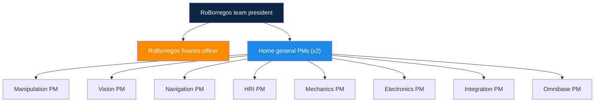
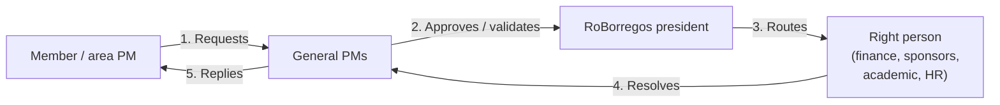

# Project Management at Home

This section is the operational manual for the Project Managers (PMs) of the @Home team. It exists because every new PM re-learns the same lessons by trial and error: recruiting, onboarding, keeping spotlights alive, chasing finances for hardware, and building Gantts that survive past March. The goal is that the next person walking into the role has one place to read that tells them what the job actually is, what cadence to keep, and where everything lives.

!!! tip "If you just became a PM"
    Read this page, then go in this order: [Cadence](cadence.md), [Onboarding](onboarding.md), [Recruiting](recruiting.md), [Finances](finances.md), [Planning](planning.md), [Handoff](handoff.md).

## What you will find here

-   :material-account-group:{ .lg .middle } **[Recruiting](recruiting.md)**

    ---

    How new members enter Home: advanced candidates from RoBorregos,
    beginners who outgrew juniors, internal migrations, and the global
    team census form.

-   :material-rocket-launch:{ .lg .middle } **[Onboarding](onboarding.md)**

    ---

    What happens in the first general meeting, what each area must do
    afterwards, and how to set the expectation of self-driven learning.

-   :material-calendar-clock:{ .lg .middle } **[Cadence](cadence.md)**

    ---

    The four weekly meetings, how spotlights get written, and the
    yearly calendar: TMR, RoboCup, TDP, demos.

-   :material-cash-multiple:{ .lg .middle } **[Finances](finances.md)**

    ---

    How to get hardware approved, from quoting to the RoBorregos
    finance officer.

-   :material-chart-gantt:{ .lg .middle } **[Planning](planning.md)**

    ---

    Why Gantts break in the middle of the year, and the two practices
    that did help: making cross-area dependencies visible and
    estimating in person-weeks instead of calendar weeks.

-   :material-handshake:{ .lg .middle } **[Handoff](handoff.md)**

    ---

    Checklist for the end of your cycle: state of the system, open
    items, key contacts, and credentials for the next PM.

## How the PM team is organized

Home has **two general PMs** and **one PM per area**. The areas as of this writing are:

- Manipulation
- Vision
- Navigation
- HRI
- Mechanics
- Electronics
- Integration
- Omnibase (mobile base)

### What each role does

=== "General PMs"

    The general PMs are the public face of Home and the bridge to the
    organization above. Their responsibilities:

    - Set the macro pace of the year: timelines, deadlines, what is
      expected by month and by cycle.
    - Organize everything competition related (TMR, RoboCup,
      registration, travel, logistics).
    - Stay aware of every area. If a member is underperforming, talk
      to them; if the issue grows, escalate to the team president.
    - Approve requests from area PMs (especially purchases) before
      pushing them up to the president.
    - Coordinate with the leads of sister competitions (Home Maze,
      Soccer, RoboMaster, etc.) in the cross-competition meeting.

=== "Area PMs"

    Each area PM owns what happens inside their area.

    - Runs the weekly area meeting: assigns tasks, resolves blockers,
      listens to progress reports.
    - Keeps the area's weekly spotlight up to date (either writes it
      directly or consolidates what members report).
    - Asks the general PMs for purchases when the area needs hardware
      or licenses.
    - Runs the deep onboarding of new members assigned to the area
      after the general welcome meeting.
    - Has 1:1 conversations with members who are not delivering. If it
      keeps happening, escalates to a general PM.

## Escalation flow

When an area PM needs something they cannot resolve themselves:

This applies to purchases, serious issues with a member, sponsor outreach, scholarship requests, events, press, and anything that touches the organization above Home.

!!! warning "Do not skip steps"
    When something is urgent, the temptation is to walk straight up to the president or to finance. Do not do that. The general PM needs the context to coordinate and to defend the case upstream. If you skip them, the general PM may walk into a meeting without context and the decision stalls.

## Glossary

| Term | Meaning |
|---|---|
| **RoBorregos** | Robotics team representing Tec de Monterrey campus Monterrey. Home is one of its competitions; sister competitions include Home Maze, Soccer, RoboMaster. |
| **FRIDA** | Home's robot (Friendly Robotic Interactive Domestic Assistant). |
| **Advanced candidate** | RoBorregos applicant who joined with prior experience. Usually goes straight into Home. |
| **Beginner candidate** | Applicant with no prior experience. Usually starts in juniors. If they no longer qualify for juniors by age, they often end up in Home. |
| **Junior** | Junior categories of RoBorregos (other competitions, not Home). After one year, members can migrate to Home. |
| **TMR** | Torneo Mexicano de Robótica (April / May). National competition. |
| **RoboCup** | International competition (June / July). Only if you qualified at TMR. |
| **TDP** | Team Description Paper. Yearly article describing the system; required submission for RoBoCup. |
| **Spotlight** | Weekly area update. Lives in this site (Home-Docs) under each area's *Weekly Spotlights*. |
| **Team president** | Head of the RoBorregos organization. Approves financial and disciplinary escalations. |

## What this section is not

- It is not the technical documentation of the project. For how the code works, see [Development](../index.md) (Manipulation, Vision, Navigation, HRI).
- It is not a formal disciplinary manual. Conduct policy comes from Tec and from RoBorregos.
- It is not static. If a process changes, edit this page in the same PR. Every PM generation inherits this doc; it only improves if you maintain it.
