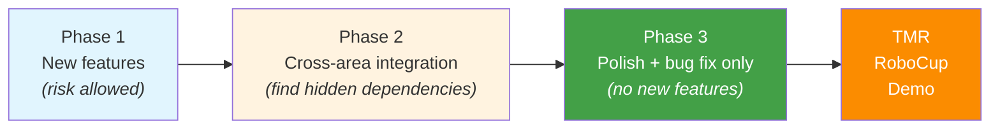

# Planning

Home's Gantts break in the middle of the year. This is **predictable**. It happens every year and there are two well-identified reasons. This page documents what did not work, what did, and proposes a path forward.

!!! warning "This is opinion based on experience, not official process"
    What follows is what I learned doing the PM role. Take it as a starting point and improve it during your cycle if you find something better.

## What is currently used: Miro

Today Gantts live in **Miro**. The reality:

- **It does not really work.** The tool is visually pleasant but ends up divorced from the actual work. Miro says one thing; the repo and the spotlights say another.
- **Nobody opens it after the first week.** If the Gantt is not part of the daily flow, it stops existing.
- **No formal dependencies.** Miro does not force you to mark what blocks what. Cross-area dependencies end up living in the PM's head.

## What did work

Two practices that did reduce the gap between plan and reality.

### 1. Make cross-area dependencies visible

Home tasks get stuck **because they depend on another area** and the PM did not see it coming. Real examples:

- *Manipulation* needs a new object detection from *Vision*. *Vision* is now the blocker.
- *Navigation* needs a new localization callback from *Integration*. *Integration* is the blocker.
- *HRI* needs the arm to reach a specific pose. *Manipulation* is the blocker.

If those dependencies are not **listed somewhere** and **reviewed weekly**, areas discover they are blocked three weeks before TMR. Too late.

**Recommendation**: in the weekly PM meeting, walk through a **list of cross-area tasks**. Even a simple sheet works:

| Task | Owner area | Depends on | Blocked by | Status |
|---|---|---|---|---|
| Pick bottle | Manipulation | Vision: detect bottle | Vision | In progress |
| Restaurant find customer | Vision | (none) | (none) | OK |
| HRIC GoToHand | Manipulation | Vision: hand pose | HRI + Vision | OK |

### 2. Estimate in "person-weeks", not "calendar weeks"

A calendar week is **not** a work week for a member. Home members are students with classes, midterms, and other commitments. A task that would take one full work week consumes several calendar weeks of any single member.

**Recommendation**: when you estimate, write the estimate as person-weeks of a specific member, not raw weeks. When midterms hit, or Semana Tec, or holidays, the person-weeks do not advance, but the calendar weeks do.

```
Task: Pick refactor
Estimate: ~4 person-weeks of the assigned member
Realistic calendar: noticeably longer, factor in Semana Tec, midterms, holidays
```

If a task needs two people from different areas, it does not get twice as fast. Coordination has a cost, and neither of them is at 100%.

## Calendar that does not move

These yearly milestones **are not negotiable**:

- **TMR** (April / May): set by the organizer. You cannot ask for an extension.
- **RoboCup** (June / July): same.
- **TDP deadline**: set by RoboCup. No TDP, no competing.
- **Sponsor demos**: scheduled by the team president, not by you.

Everything else (internal sprints, refactors, experimental features) is negotiable. When the Gantt breaks, the instinct is to push TMR. You cannot. What you can move is **scope**.

## Tooling proposal: a central Gantt plus per-area tools

Not every area in Home is a software area. Mechanics, Electronics, and others do not naturally live in GitHub, so forcing them to track work as issues and project boards adds friction without value. At the same time, a single project-wide view of where each area is matters: it is the only way to spot dependencies and slipping milestones early.

A proposal that balances both:

1. **One central, project-level Gantt** that lives somewhere everyone can see. Two practical options:
    - An **embedded Miro board** inside [goroborregos.com](https://goroborregos.com) or this Home-Docs site, kept up to date by the general PMs.
    - The same Miro board screenshot, pasted into a page in this site that the general PMs refresh weekly.

    The point is one place to look. Whatever tool, it has to be reachable in two clicks.

2. **Each area picks its own tool** for internal planning, with one requirement: it must produce something that can be plugged into the central view.

    | Area style | Suggested tool | Why |
    |---|---|---|
    | Software (Manipulation, Vision, Navigation, HRI, Integration, Omnibase) | GitHub Projects + Issues + Milestones | Lives where the code is. Linked PRs advance the board automatically. |
    | Hardware / physical (Mechanics, Electronics) | Miro, Notion, or a shared sheet | Visual planning works better when most work is not commits. |

3. **At the cadence of the PM meeting**, each area PM brings their plan view (GitHub board screenshot, Miro export, whatever) and the general PMs consolidate it into the central Gantt.

This is a proposal, not the current process. Today the team relies mostly on Miro and the Gantts that exist there are not very alive. Whether to push for this restructuring is a call the next PMs can take.

### Suggested setup for software areas using GitHub

If your area is in software and decides to try GitHub Projects:

- **Project board** per cycle (for example `Home 2026`).
- **Issues** with labels: `area/manipulation`, `area/vision`, etc., plus `type/feature`, `type/bug`, `type/research`, `priority/p0..p3`.
- **Milestones** per big date (`TMR 2026`, `RoboCup 2026`, `Sponsor demo March`).
- **Linked PRs**: when someone opens a PR, link it to the issue so the board advances on its own.

## A suggested cycle structure (not team policy)

!!! info "This is an idea, not how Home currently runs"
    Home does not formally split the year into phases. The structure below is a proposal from a past PM that, when applied, helped avoid the kind of last-minute chaos that hits the team every TMR. If it makes sense to you, adopt it. If not, ignore it.

The proposal is to think of the cycle in three phases, each with a different "permission":



### Phase 1. New features (longest stretch, after onboarding)

Each area works on its ambitious features. This is the phase where risk is allowed; things that might not work are part of the deal.

### Phase 2. Integration

What was built in phase 1 needs to connect across areas. **This is when the cross-area dependencies you did not see before show up.** Plan this phase with more buffer than you think you need; cross-area work is always slower than it looks.

### Phase 3. Polish (also called "feature freeze")

Some weeks before TMR (the exact number is your call), the team should stop merging new functionality and switch to:

- Bug fixes.
- End-to-end scenario tests.
- Polish (UI, logs, debug tools, recovery flows).
- Competition rehearsals.

The term "feature freeze" comes from software releases: from a chosen date, only fixes go in, no new features. Home does not enforce this strictly today, but the idea is solid. The member who says "it is small and I can finish in two days" almost always introduces a bug the team finds the day before competing. A soft freeze, even if it is not formal policy, helps avoid that.

## Common mistakes

- **Yearly plan without replanning**. The plan you write at the start of the cycle does not survive contact with reality. Re-plan every few weeks.
- **Not marking dependencies**. The line "ah, I did not know you needed that" is the most expensive sentence of the year.
- **Estimating in calendar weeks instead of person-weeks**. The biggest source of slippage.
- **Accepting new functionality up to the last weeks before TMR**. Almost always introduces a bug that bites during the competition.
- **No buffer**. Things take longer than planned. Plan for that, do not pretend otherwise.
