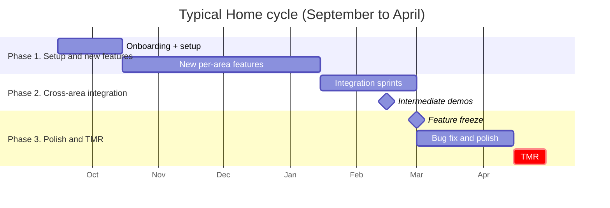

# Planning

Home's Gantts break in the middle of the year. This is **predictable**. It happens every year and there are two well-identified reasons. This page documents what did not work, what did, and proposes a path forward.

!!! warning "This is opinion based on experience, not official process"
    What follows is what I learned doing the PM role. Take it as a starting point and improve it during your cycle if you find something better.

## What is currently used: Miro

Today Gantts live in **Miro**. The reality:

- **It does not really work.** The tool is visually pleasant but ends up divorced from the actual work. Miro says one thing; the repo and the spotlights say another.
- **Nobody opens it after the first week.** If the Gantt is not part of the daily flow, it stops existing.
- **No formal dependencies.** Miro does not force you to mark what blocks what. Cross-area dependencies end up living in the PM's head.

## What did work

Two practices that did reduce the gap between plan and reality.

### 1. Make cross-area dependencies visible

Home tasks get stuck **because they depend on another area** and the PM did not see it coming. Real examples:

- *Manipulation* needs a new object detection from *Vision*. *Vision* is now the blocker.
- *Navigation* needs a new localization callback from *Integration*. *Integration* is the blocker.
- *HRI* needs the arm to reach a specific pose. *Manipulation* is the blocker.

If those dependencies are not **listed somewhere** and **reviewed weekly**, areas discover they are blocked three weeks before TMR. Too late.

**Recommendation**: in the weekly PM meeting, walk through a **list of cross-area tasks**. Even a simple sheet works:

| Task | Owner area | Depends on | Blocked by | Status |
|---|---|---|---|---|
| Pick bottle | Manipulation | Vision: detect bottle | Vision | In progress |
| Restaurant find customer | Vision | (none) | (none) | OK |
| HRIC GoToHand | Manipulation | Vision: hand pose | HRI + Vision | OK |

### 2. Estimate in "person-weeks", not "calendar weeks"

A calendar week is **not** a work week for a member. The average Home member contributes 8 to 15 hours per week. A 40-hour task is therefore **three to five calendar weeks of that person**, not one.

**Recommendation**: when you estimate, write "**3 person-weeks of Fulano**" instead of "3 weeks". When midterms hit, or Semana Tec, or holidays, the person-weeks do not advance. The calendar weeks do.

```
Task: Pick refactor
Estimate: 4 person-weeks of Domínguez (about 60 hours)
Realistic calendar: 6 to 8 calendar weeks (includes Semana Tec + midterm)
```

If a task needs two people from different areas, it does not get twice as fast. Coordination has a cost, and neither of them is at 100%.

## Calendar that does not move

These yearly milestones **are not negotiable**:

- **TMR** (April / May): set by the organizer. You cannot ask for an extension.
- **RoboCup** (June / July): same.
- **TDP deadline**: set by RoboCup. No TDP, no competing.
- **Sponsor demos**: scheduled by the team president, not by you.

Everything else (internal sprints, refactors, experimental features) is negotiable. When the Gantt breaks, the instinct is to push TMR. You cannot. What you can move is **scope**.

## Proposal: standardize on GitHub

GitHub Projects + Issues + Milestones have advantages Miro does not.

| | Miro | GitHub |
|---|---|---|
| Timeline / Gantt view | yes | yes (Roadmap view) |
| Formal dependencies | no | yes (linked issues) |
| Lives where the code lives | no | yes |
| Members open it without thinking | no | yes |
| Metrics / burndown | no | yes |
| API for automation | no | yes |

!!! tip "Concrete proposal"
    As a pilot, start with **one area** (your own) in GitHub Projects. If it works, propose migrating the rest after TMR. Do not migrate everything mid-cycle.

Recommended setup per area:

- **Project board**: one board per cycle (`Home Q1 2027`, `Home Q2 2027`).
- **Issues** with labels: `area/manipulation`, `area/vision`, ..., `type/feature`, `type/bug`, `type/research`, `priority/p0..p3`.
- **Milestones**: one per big milestone (`TMR 2027`, `RoboCup 2027`, `Sponsor demo March`).
- **Linked PRs**: when someone opens a PR, link it to the issue so the board advances on its own.

## Cycle structure

A typical Home cycle (about six months, September to April) splits into three phases.



### Phase 1. New features (October to January)

Each area works on its ambitious features. This is the phase where risk is allowed (things that might not work).

### Phase 2. Integration (January to March)

What was built in phase 1 needs to connect across areas. **This is when the cross-area dependencies you did not see before show up.** Plan this phase with 50% more buffer than you think.

### Phase 3. Feature freeze (March to TMR)

Six weeks out from TMR, **no new features**. Only:

- Bug fixes.
- End-to-end scenario tests.
- Polish (UI, logs, debug tools, recovery flows).
- Competition rehearsals.

!!! danger "Ignoring the feature freeze is the #1 cause of TMR failure"
    The member who says "it's small and I can finish in two days" introduces a bug the team finds the day before competing. This happens every year. Hold the line.

## Common mistakes

- **Yearly plan without replanning**. The September Gantt does not survive November. Re-plan every four to six weeks.
- **Not marking dependencies**. The line "ah, I did not know you needed that" is the most expensive sentence of the year.
- **Estimating in calendar weeks instead of person-weeks**. Explains 80% of slippage.
- **Accepting features up to the last month**. Guarantees bugs at TMR.
- **No buffer**. Reality is 30% slower than the plan. Plan for that.
