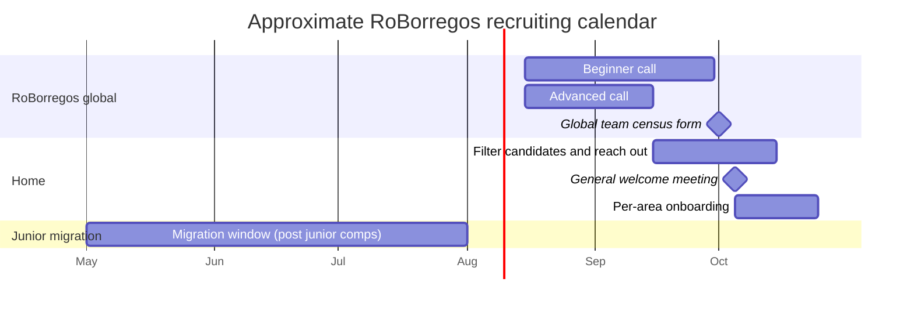

# Recruiting

Home does not run its own open call. New members arrive through **RoBorregos**, the robotics team that represents Tec de Monterrey campus Monterrey. As a PM your job is not to publish a public form. Your job is to **spot the right candidates inside the natural RoBorregos flow and pull them into Home at the right moment**.

## Where members come from

Three intake paths are active in any given year.

### 1. Advanced candidates go straight to Home

Every year RoBorregos runs an internal call that splits applicants into **beginners** and **advanced**. Advanced candidates already have experience (personal projects, other competitions, prior courses) and **usually skip juniors and join Home directly**. This path delivers the highest quality intake: people who already know Linux, programming, and sometimes ROS.

!!! tip "Catch them early"
    In the first general meeting, ask each new member where they come from. If they are advanced candidates, they are pre-qualified. If they are beginners who landed in Home for other reasons, see the next paths below.

### 2. Beginners who outgrew juniors

Some beginner candidates are accepted into RoBorregos but **no longer qualify for junior categories by age** (FLL, FTC, WRO, etc.). Those members often land in Home because Home is one of the few RoBorregos competitions with no junior age cap.

These members usually need **more technical onboarding** than advanced candidates. They might have no exposure to Linux, ROS, or Docker. Plan for that from the start (see [Onboarding](onboarding.md)).

### 3. Internal migration from juniors

Members who joined RoBorregos as juniors and competed in a junior competition can, **one year later**, decide they no longer want to keep doing juniors. At that point they can migrate to Home.

This path tends to produce the most committed members. They have already spent a year inside RoBorregos and know the culture. But you need to find them actively; they do not show up by themselves.

## The team census form

When RoBorregos publishes the **global team spotlight** (not Home's, the one that covers every competition), it should include a **form for interested members to apply to next year's competitions**. That form is the way to keep a roster of who belongs to which competition.

As a PM, your responsibilities around the form are:

- [ ] **Make sure Home appears as an option** on the global team form. Coordinate with the general PMs so this happens.
- [ ] **Review the responses as soon as the form closes**. It tells you:
    - How many members you start the cycle with.
    - Which advanced candidates self-selected into Home.
    - Which members are migrating from juniors.
- [ ] **Talk 1:1 with each advanced candidate** to confirm interest and give them a small technical task as a smoke test.
- [ ] **For beginners who ended up in Home** by the age path, plan their [extended onboarding](onboarding.md#for-members-without-technical-background) during the first week.

## When each intake path opens

!!! info "Dates are approximate"
    Exact dates are set by RoBorregos every year and announced on the team's main channels. Confirm with the general PMs as soon as you start your cycle.

## Criteria to accept (or not) someone in Home

Home expects more autonomy than juniors. Before accepting, check that the candidate:

| Question | Why it matters |
|---|---|
| Are they comfortable in a Linux terminal? | The stack runs on Ubuntu and Docker. Without Linux, the first two weeks are pure frustration. |
| Can they program in Python or C++? | All project code is one of those. If not, they should be willing to learn one in the first few weeks. |
| Are they willing to learn on their own? | Home requires self-driven learning. If they expect a step-by-step tutorial for everything, they will not fit. |
| Can they commit at least 10 hours per week? | Active areas need that minimum to make real progress. |
| Is it a problem that you do not know them personally? | Knowing the candidate from a previous team can help, but it can also bias your reading. Notice the bias. |

These are not formal team criteria. They are **signals you learn to read as a PM**. When in doubt, schedule a short interview before making the assignment official.

## Common recruiting mistakes

- Accepting every applicant without filtering. Leads to demotivated members by week four.
- Not reaching out to advanced candidates fast enough. Another competition (Soccer, Maze) takes them if Home is slow.
- Forgetting the junior-migration window. Members who hit one year in RoBorregos are ripe, but you need to go get them.
- Not coordinating Home's presence on the global form with the general PMs. If your competition is not listed, no one applies.
