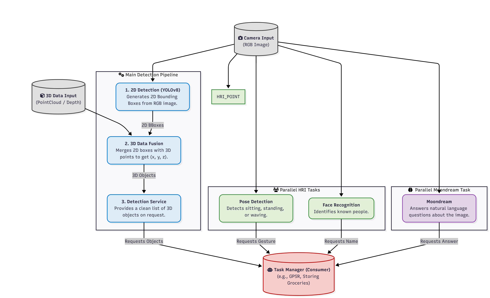

# Computer Vision

This module focuses on two main areas: Human Analysis and Object Detection, obtaining images from a Stereolabs ZED2. Additionally, this year we also explored Visual-Language Models (VLMs) to enhance our capabilities in understanding visual content. To check the current architecture, check the [Vision Architecture](Architecture.md) document.

### Human Analysis
This subarea focuses on analyzing human features and behaviors using computer vision techniques. Some of the main tasks include:

- [Recognizing faces](Human%20Analysis/Face%20Recognition.md)
- [Tracking persons and re-identifying them across different frames](Human%20Analysis/Person%20Tracking.md)
- [Detecting poses and gestures](Human%20Analysis/Poses%20and%20Gestures.md)
- Identifying combination of clothes and colors
- Describing a person

  
### Object Detection
The main objective of this subarea is the [dataset generation pipeline](Object%20Detection/Dataset%20Pipeline.md) used to train a YOLO model. However it also includes the integration of [zero-shot](Object%20Detection/Zero-Shot%20Detections.md) models or other alternatives as a plan B for object detection. Additionally, this year an alternative to [shelf level detection](Object%20Detection/Shelf%20Detection.md) was explored using mainly opencv.

### VLM
This subarea explores visual-language models (VLMs) to enhance the understanding of visual content in conjunction with language processing. Currently, the team uses the model [moondream](VLM/Moondream.md) for image prompting.

## General pipeline

The following diagram provides an overview of the vision pipeline, illustrating how visual data from the ZED camera is processed through interconnected subsystems for human analysis, object detection, and visual–language understanding. The information produced by these subsystems is fused to generate a structured representation of the environment, enabling interaction and high-level decision-making in a home setting.

## Running vision

For details on how to run the vision module, check the home repo: [Run Vision](https://github.com/RoBorregos/home2/blob/main/docs/Run/Areas/vision.md)

